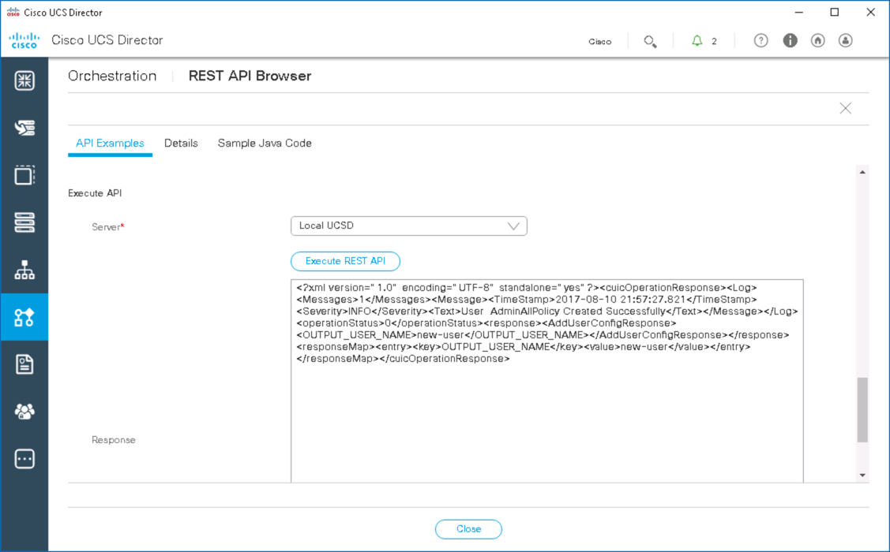

# Using the UCS Director API - Query, Configure, Manage, Execute

# Step 2
The REST API Browser also performs Creates, Updates, and Deletes. Use the REST API Browser to create, update, and delete a user.

### Exercise 3

  1. Create a user
    - Double-Click on the task with the **ID** of **user@CREATE**

      

    <!---  --->

  2. Enter the following values:

    - `Login Name` - **new-user**
    - `Password` - **cisco123**
    - `Confirm Password` - **cisco123**
    - `User Contact Email` - **new-user@dcloud.cisco.com**

      

    <!---  --->

  3. Scroll down and Click **Generate XML**.

    

  <!---  --->

  4. Scroll down and Click **Execute REST API**.

    

  <!---  --->

  If everything was entered correctly, you should see a success message in the **Response** window. If there was an error with the request, then an error would be displayed in the **Response** window.

  5. Click **Close**.

### Exercise 4

  1. Update a user
    - Double-Click on the task with the **ID** of **user@UPDATE_USER**

      

    <!---  --->

  2. Enter the following values.

    - `Login Name` - Select the user **new-user**
      - Click the plus-sign next to "Login Name"
      - Check the checkbox next to new-user
      - Click the "Validate" button, this will fill the fields with known values.
    - `First Name` - **New**
    - `Last Name` - **User**

      

    <!---  --->

  3. Scroll down and Click **Generate XML**.

      

    <!---  --->

  4. Scroll down and Click **Execute REST API**.

      

    <!---  --->

  5. Verify that the user **new-user** was updated      
    - Click **Close**
    - Double-click on the task with the **ID** of **user@READ**
    - Add **new-user** to the end of the Resource URL
    - Click **Execute REST API**
    - Verify that first name `New` and the last name `User` was updated for the user.

    The Resource URL should look as follows

    `/cloupia/api-v2/user/new-user`

      

    <!---  --->

  6. Click **Close**.

### Exercise 5

  1. Delete a user:  

    - Double-click on the task with the **ID** of **user@DELETE_USER**
    - Select the Login Name **new-user**
    - Click **Generate XML**
    - Click **Execute REST API**.

      

    <!---  --->

    View the successful deletion message for user **new-user**.

  2. Click **Close**.

Next Step: Run REST API Examples from Postman.
