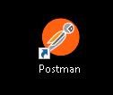
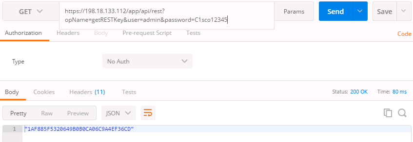
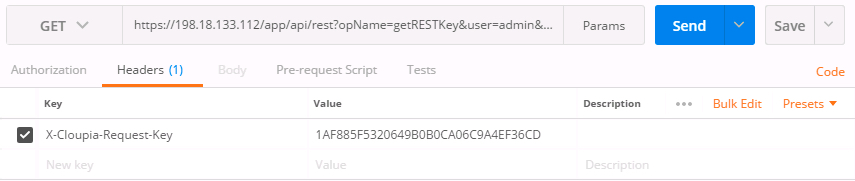
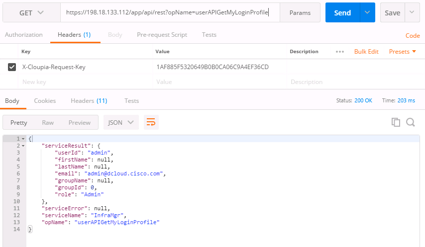
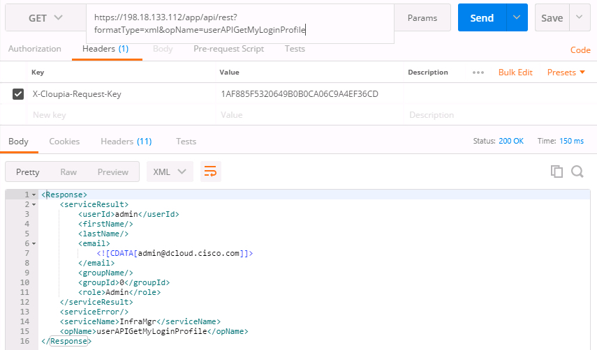
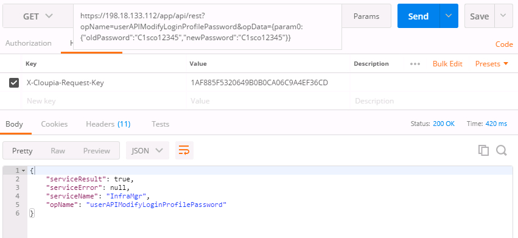
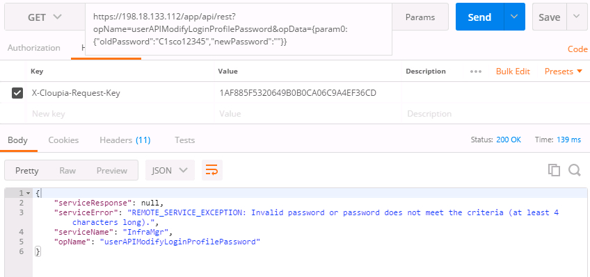

# Using the UCS Director API - Query, Configure, Manage, Execute

# Step 3
Retrieve your REST API Access Key via the REST API. Retrieve your user profile via the REST API.

These exercises make use of **Postman**, a REST API Client to issue the REST API calls.

### Exercise 6

  1. Open Postman.

  1. To launch **Postman** double-click the Postman icon on the desktop.

  UCS Postman Desktop Shortcut:

    <br/><br/>

    <!---<br/><br/>--->

  1. In the Postman interface issue a **Get** with the following URL:

    ```code
    https://198.18.133.112/app/api/rest?opName=getRESTKey&user=admin&password=C1sco12345
    ```

    <br/><br/>

    <!---<br/><br/>--->

  2. Copy the returned REST API Access Key and create a header for future REST API requests. The header name is "X-Cloupia-Request-Key". Set the value to the returned REST API Access Key.

    - Click **Headers** to enter the REST API Access Key.

    <br/><br/>

    <!---<br/><br/>--->

  3. With the REST API Access Key now available as a header, successive calls to the UCS Director REST API will authenticate utilizing `X-Cloupia-Request-Key`. Try retrieving your user profile using the REST API call `userAPIGetMyLoginProfile`.

  ```code
  https://198.18.133.112/app/api/rest?opName=userAPIGetMyLoginProfile
  ```

    <br/><br/>

    <!---<br/><br/>--->

  The returned data is in JSON format, however XML could have been specified. Notice that `formatType` was not specified in the URL, only `opName`. UCS Director REST API URLs have three possible parameters:

    - `formatType` - {json|xml}
    - `opName` - the REST API Operation
    - `opData` - {param0:"name",param1:"state",paramN:0}

  `opName` is always required, `opData` is only required when the opName operation requires data, and `formatType` is only required when a format other than JSON is required.

  4. Try adding `formatType=xml` to the last call.

  ```code
  https://198.18.133.112/app/api/rest?formatType=xml&opName=userAPIGetMyLoginProfile
  ```

    <br/><br/>

    <!---<br/><br/>--->

  Notice that the output format is XML.

  Also notice that the operation status was returned along with the user profile. In this case the serviceError was `null`, so a success. Also notice that the http Status is `200 OK`

### Exercise 7

Change your password via the REST API.

  1. Use `userAPIModifyLoginProfilePassword` to change the password of the currently logged in user. This REST API call requires `opData` to complete the task.

  ```code
  https://198.18.133.112//app/api/rest?opName=userAPIModifyLoginProfilePassword&opData={param0:{"oldPassword":"C1sco12345", "newPassword":"C1sco12345"}}
  ```

  The opData parameter is a JSON structure with a single `param#` specification.

    <br/><br/>

    <!---<br/><br/>--->

  For this operation only status was returned, indicating success or failure.

  You can specify the same password for the old and new password, the REST API will not complain.  However, if you specify a blank password for the new password an error will be returned indicating that the new password must be at least 4 characters in length.

  2. Specify a blank password in the new-password portion of the opData.

  ```code
  https://198.18.133.112//app/api/rest?opName=userAPIModifyLoginProfilePassword&opData={param0:{"oldPassword":"C1sco12345", "newPassword":""}}
  ```

    <br/><br/>

    <!---<br/><br/>--->

  An error should have been returned.

Congratulations! You've completed the lab - Using the UCS Director API - Query, Configure, Manage, Execute
