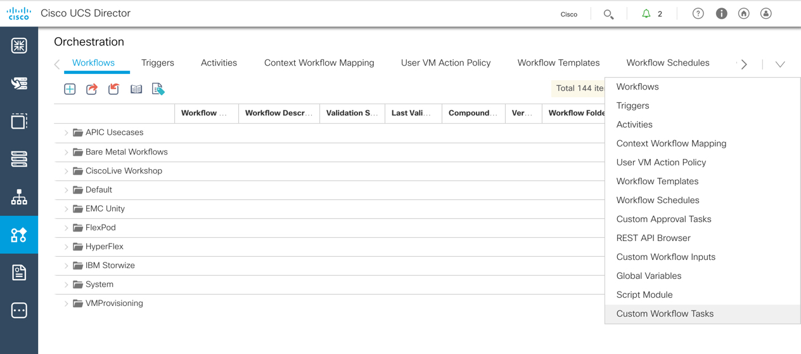
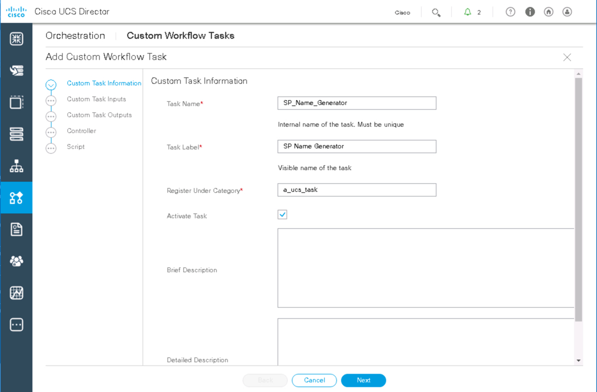
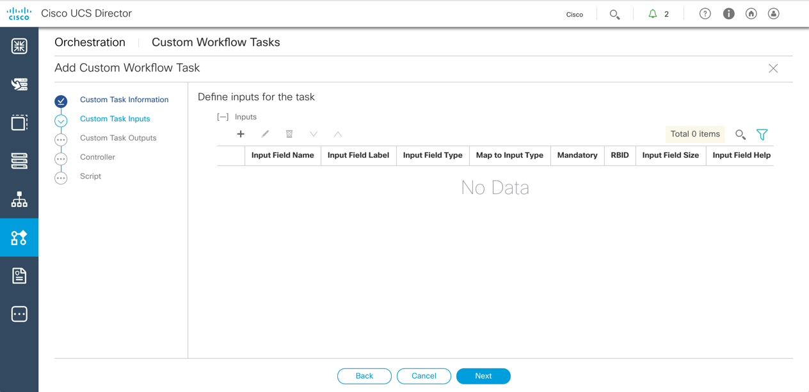
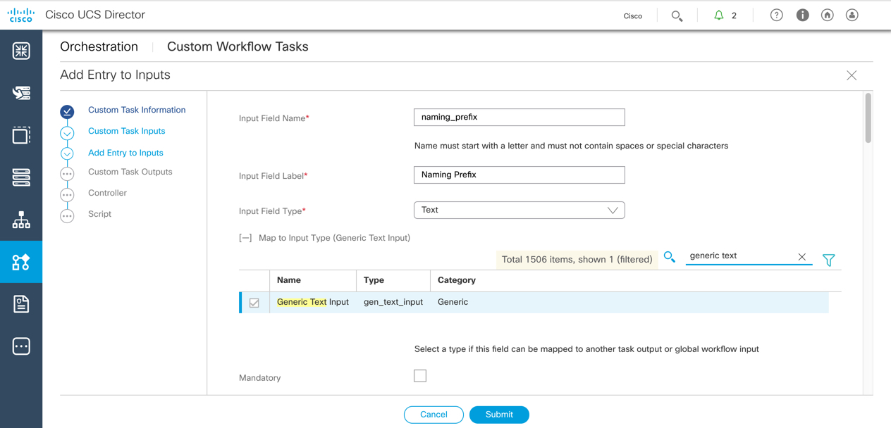
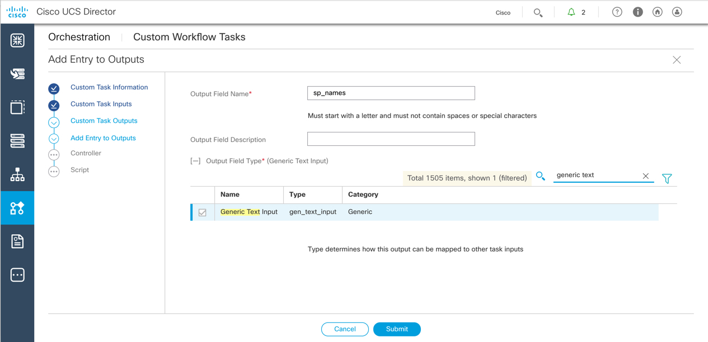
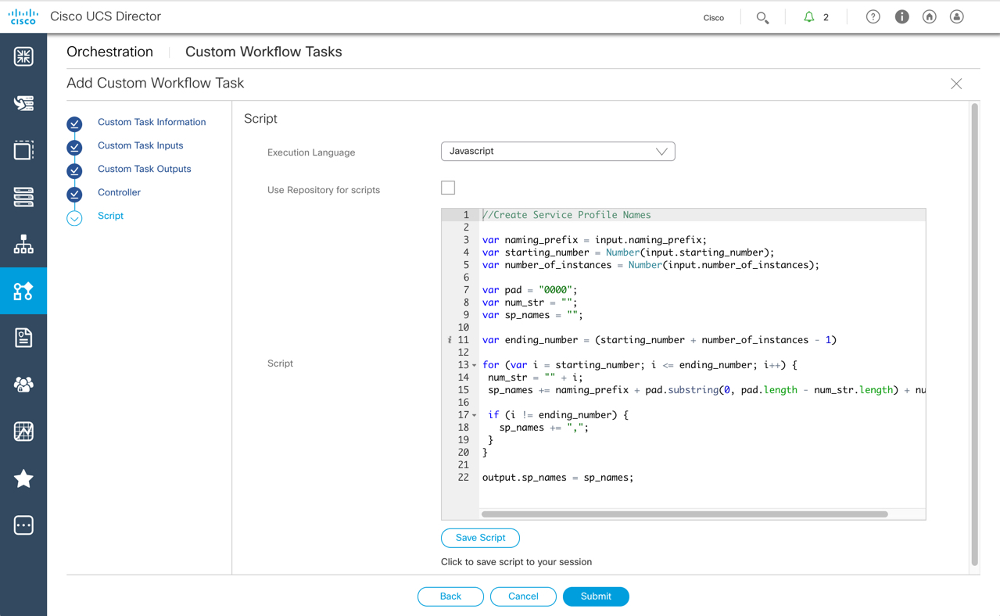
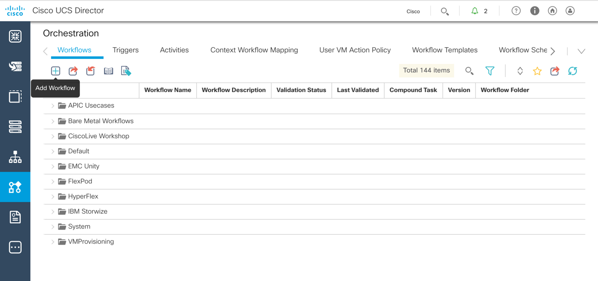

# A Server By Any Other Name - Creating and Utilizing UCS Director Custom Tasks

This lab will get you creating UCS Director Custom Tasks and utilizing them in workflows.

## Objectives

Completion time: 20 minutes

  - Create a Custom task
  - Add the Task to a Workflow
  - Execute the Workflow
  - View the Workflow results

## Prerequisites

Basic knowledge of UCS Director and some JavaScript would be useful, but not necessary. Other than that a desire to learn is all you need to bring with you.

## UCS Director

Cisco UCS Director is a complete, highly secure, end-to-end management, orchestration, and automation solution for a wide array of Cisco and non-Cisco data center infrastructure components, and for the industry's leading converged infrastructure solutions based on the Cisco UCS and Cisco Nexus platforms. For a complete list of supported infrastructure components and solutions, see the [Cisco UCS Director Compatibility Matrix](http://www.cisco.com/c/en/us/support/servers-unified-computing/ucs-director/products-device-support-tables-list.html).

Cisco UCS Director is a 64-bit appliance that uses the following standard templates:

  - Open Virtualization Format (OVF) for VMware vSphere
  - Virtual Hard Disk (VHD) for Microsoft Hyper-V

Cisco UCS Director extends the unification of computing and network layers through Cisco UCS to provide you with comprehensive visibility and management of your data center infrastructure components. You can use Cisco UCS Director to configure, administer, and monitor supported Cisco and non-Cisco components. The tasks you can perform include the following:

  - Create, clone, and deploy service profiles and templates for all Cisco UCS servers and compute applications.
  - Monitor organizational usage, trends, and capacity across a converged infrastructure on a continuous basis.
  - Deploy and add capacity to converged infrastructures in a consistent, repeatable manner.
  - Manage, monitor, and report on data center components, such as Cisco UCS domains or Cisco Nexus network devices.
  - Extend virtual service catalogs to include services for your physical infrastructure.
  - Manage secure multi-tenant environments to accommodate virtualized workloads that run with non-virtualized workloads.

# Step 1

This lab focuses on creating a custom task, adding that task to a workflow, executing the workflow, and viewing the results and status.

### Exercise 1
Launch and login to UCS Director

  1. To launch UCS Director double-click the UCS Director icon on the desktop.

  UCS Director Desktop Shortcut:

    <br/><br/>

    <!---<br/><br/>--->

  2. Enter the username and password, and click **Login**:
    - `username`: **admin**
    - `password`: **C1sco12345**

  UCS Director Login Screen:

    <br/><br/>

    <!---<br/><br/>--->

### Exercise 2
UCS Servers are only available/active when they have an associated Service Profile. The Service Profile supplies identities, configuration, BIOS settings, and others. Service Profile Templates are used to create a recipe, so to speak, for the ingredients required to create Service Profiles.

In UCS Manager when creating multiple Service Profiles from a template you specify a prefix, a starting number, and a count of how many Service Profiles you would like to instantiate from the template. However, there is no way to indicate a pattern for the Service Profile name. For example if you indicated that you would like 3 Service Profiles to be instantiated with a prefix of `CrimeLabHost_` starting at the number 9, the created Service Profiles would be named:

  - `CrimeLabHost_9`
  - `CrimeLabHost_10`
  - `CrimeLabHost_11`

Those who are programmatically minded would cringe at these results. What would be better is a zero-padded number for the suffix.

In this exercise you create a UCS Director Custom Task that takes the following inputs:

  - Naming Prefix
  - Starting Number
  - Number of Instances

From the inputs the output will be a comma separated list of generated names with a 4 character zero-padded suffix.

From the example above the inputs would be the following:

  - `Naming Prefix`: **CrimeLabHost_**
  - `Starting Number`: **9**
  - `Number of Instances`: **3**

The output should be the following:

  - `CrimeLabHost_09,CrimeLabHost_10,CrimeLabHost_11`

1. On the menu bar, choose **Policies** > **Orchestration**.

  UCS Director Orchestration Screen:

    <br/><br/>

    <!---<br/><br/>--->

2. On the Ochestration Screen click the down-facing arrow on the right to view all the available tabs, select **Custom Workflow Tasks**.

  UCS Director Create Custom Task:

    <br/><br/>

    <!---<br/><br/>--->

3. To create a custom task:

  - Click the **Add** button to open the **Add Custom Workflow Task** dialog box. The dialog box is split into five separate pages.

    - On the **Custom Task Information** page enter the following values:
      - `Task Name`: **SP_Name_Generator**
      - `Task Label`: **SP Name Generator**
      - `Register Under Category`: **a_ucs_task** (you will see this later when creating the workflow)
      - Click **Next**

      <br/><br/>

      <!---<br/><br/>--->

    - On the **Custom Task Inputs** page you will create three inputs.
      - `naming_prefix`
      - `starting_number`
      - `number_of_instances`

      - Click the plus sign (+) at the top of the table in the right-hand pane, enter the following values on the **Add Entry to Inputs** dialog box.
        - `Input Field Name`: **naming_prefix**
        - `Input Field Label`: **Naming Prefix**
        - `Map to Input Type`: Click **Select...**
          - Enter **Generic Text** in the search filter.
          - Check the box next to **Generic Text Input**.
          - Click **Select**.
        - Click **Submit**.
        - Click **OK**.

        <br/><br/>

        <!---<br/><br/>--->

        <br/><br/>

        <!---<br/><br/>--->

        <br/><br/>

        <!---<br/><br/>--->

        <br/><br/>

        <!---<br/><br/>--->

        <br/><br/>

        <!---<br/><br/>--->

      - Repeat the process for the "Starting Number" input, use the following values:
        - `Input Field Name`: **starting_number**
        - `Input Field Label`: **Starting Number**
        - `Map to Input Type`: *Generic Text*

      - Repeat the process for the "Number of Instances" input, use the following values:
        - `Input Field Name`: **number_of_instances**
        - `Input Field Label`: **Number of Instances**
        - `Map to Input Type`: *Generic Text*

      - Click **Next**.

    - On the **Custom Task Outputs** page you will create one output.
      - `sp_names`

      - Click the plus sign (+) at the top of the table in the right-hand pane, enter the following values on the **Add Entry to Outputs** dialog box:

        - `Output Field Name`: **sp_names**
        - `Output Field Type`: Click **Select...**
          - Enter **Generic Text** in the search filter.
          - Check the box next to **Generic Text Input**.
          - Click **Select**.
        - Click **Submit**.
        - Click **OK**.
      - Click **Next**.

      <br/><br/>

      <!---<br/><br/>--->

      <br/><br/>

      <!---<br/><br/>--->

    - On the **Controller** page
      - Click **Next**

    - On the **Script** page enter this code:

      ```JavaScript
      //Create Service Profile Names

      var naming_prefix = input.naming_prefix;
      var starting_number = Number(input.starting_number);
      var number_of_instances = Number(input.number_of_instances);

      var pad = "0000";
      var num_str = "";
      var sp_names = "";

      var ending_number = (starting_number + number_of_instances - 1)

      for (var i = starting_number; i <= ending_number; i++) {
        num_str = "" + i;
        sp_names += naming_prefix + pad.substring(0, pad.length - num_str.length) + num_str;

        if (i != ending_number) {
          sp_names += ",";
        }
      }

      output.sp_names = sp_names;
      ```

      <br/><br/>

      <!---<br/><br/>--->

    - Click **Submit**.
    - Click **OK**.

The created task is added to the bottom of the task listing. To view your task, either scroll to the bottom of the list or click in the right side of the **ID** column to sort by ID number. You task should appear at the top.

  <br/><br/>

  <!---<br/><br/>--->

  Next Step: Add a Workflow that uses your task.
