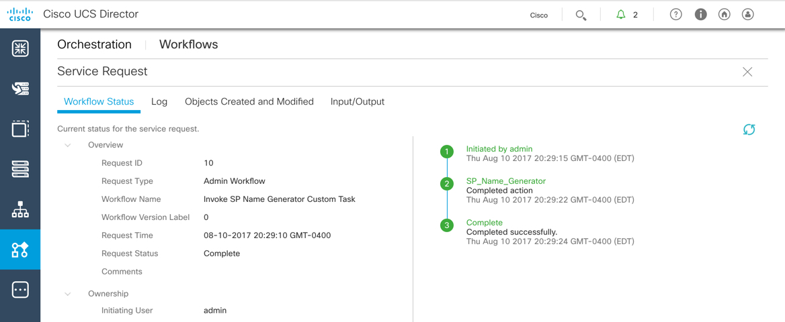

# A Server By Any Other Name - Creating and Utilizing UCS Director Custom Tasks.

# Step 2
Custom Tasks can be run via Workflows. You will create a workflow that uses the custom task and execute it. UCS Director utilizes Service Requests (SR) to manage workflow execution. In the SR you can view the details of the running workflow. In the SR details you can see the inputs and the outputs from the workflow and custom task.

### Exercise 3
Create a workflow

1. On the left side menu bar, choose **Orchestration**.

2. Click the **Workflows** tab, if it is not already selected.

3. Click **Add Workflow** to open the **Add Workflow** screen. The screen is split into three separate pages.

    

  <!---  --->

    - On the **Add Workflow Details** page enter the following values:
      - `Workflow Name`: **Invoke SP Name Generator Custom Task**
      - Check `Place in New Folder`
        - `Folder Name`: **Justice Team**
      - Click **Next**

      

    <!---  --->

    - On the **Add User Inputs** page you will create three inputs to pass to the Custom Task.
      - `Naming Prefix`
      - `Starting Number`
      - `Number of Instances`

      - Click the plus sign (+) at the top of the table in the right-hand pane, enter the following values on the **Add Entry to Inputs** screen:
        - `Input Label`: **Naming Prefix**
        - `Input Type`: Click the plus sign (+)
          - Enter "Generic Text" in the search.
          - Check the box next to **Generic Text Input**
          - Click "Validate"

            

          <!---  --->

        - Click **Submit**

        - Repeat the process for the **Starting Number** input, use the following values:
          - `Input Label`: **Starting Number**
          - `Input Type`: *Generic Text*

        - Repeat the process for the **Number of Instances** input, use the following values:
          - `Input Label`: **Number of Instances**
          - `Input Type`: *Generic Text*

        - Click **Next**

    All Three User Inputs Added:

      

    <!---  --->

    - On the **Add User Outputs** page
      - Click **Submit**

The **Workflow Designer** screen opens.

4. In the left-hand navigation
  - Click the "twistie" next to **Custom Tasks**
  - Click the "twistie" next to **a_ucs_task**
  - Click and drag the task **SP Name Generator** on to the designer canvas. This will cause the **Add Task (SP Name Generator)** dialog to open. The dialog is split into four separate pages.

      

    <!---  --->

    - On the **Task Information** page
      - Click **Next**

      

    <!---  --->

    - On the **User Input Mapping** page
      - **Naming Prefix** Section
        - Check `Map to User Input` under `Naming Prefix`
        - Select `Naming Prefix` from the drop-down
      - **Starting Number** Section      
        - Check `Map to User Input` under `Starting Number`
        - Select `Starting Number` from the drop-down
      - **Number of Instances** Section
        - Check `Map to User Input` under `Number of Instances`
        - Select `Number of Instances` from the drop-down
      - Click **Next**

    - On the **Task Inputs** page
      - Click **Next**

    - On the **User Output Mapping** page
      - Click **Submit**

        

      <!---  --->

  - Click the "X" on the right-hand side of the screen to **Close** the **Workflow Designer** screen.

    

  <!---  --->

  Your workflow has been created.

### Exercise 4
Execute the workflow and view the execution details in the Service Request.

1. Click the "twistie" next to the **Justice Team Folder** to expand the folder and display the just created "Invoke SP Name Generator Custom Task" workflow.

  - Click the workflow to select it.
  - Click **Execute Now**.

    

  <!---  --->

2. On the **Executing Workflow: Invoke SP Naming** dialog box enter the following values:

  - `Naming Prefix`: **CrimeLabHost_**
  - `Starting Number`: **8**
  - `Number of Instances`: **5**

  - Click **Submit**

    

  <!---  --->

3. On the **Service Request Submit Status**
    - Click **Show Detail Status** to open up the SR detail screen.

    

  <!---  --->

4. The Service Request detail on the **Workflow Status** tab will update automatically or you can use the Refresh action to update the content.

    

  <!---  --->

5. View the Inputs and Outputs to determine if the workflow produced the expected results:
  - Click the **Input/Output** tab.
  - Click the "twistie" next to the **SP Name Generator** folder.
  - View the results of the custom task on the **Output** line.

    

  <!---  --->

Congratulations! You've completed the lab - ***A Server By Any Other Name - Creating and Utilizing UCS Director Custom Tasks***.
