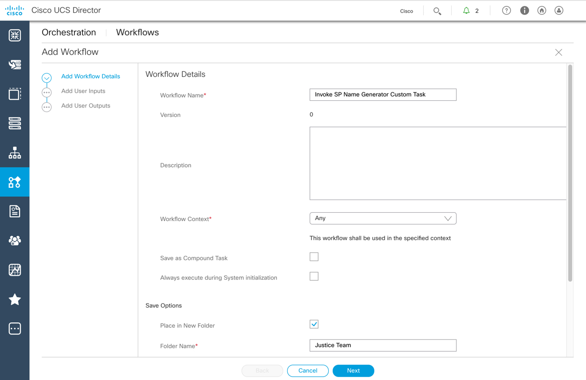
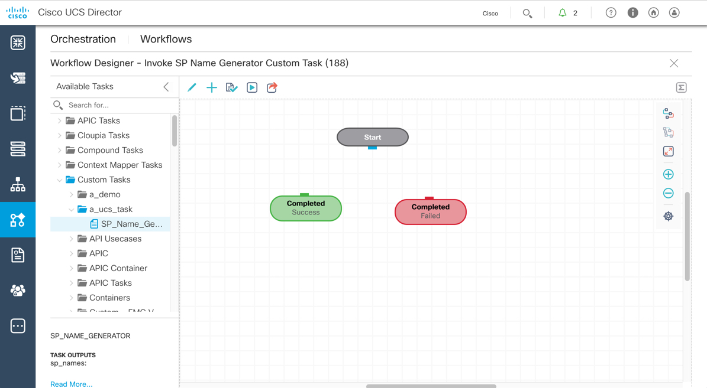
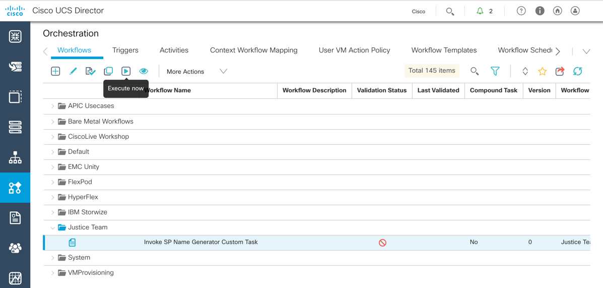
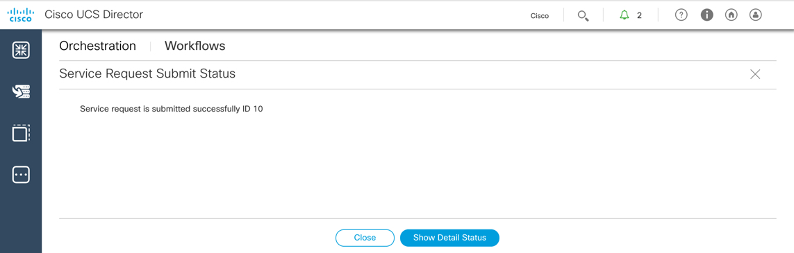
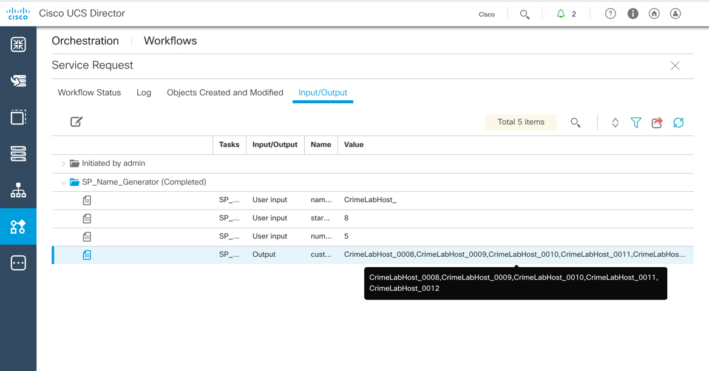

# A Server by any other name - Creating and Utilizing UCS Director Custom Tasks.

# Step 2
Custom Tasks can be run via Workflows. You will create a workflow that uses the custom task and execute it. UCS Director utilizes Service Requests (SR) to manage workflow execution. In the SR you can view the details of the running workflow.  In the SR details you will be able to see the inputs and the outputs from the workflow and custom task.

### Exercise 3
Create a workflow

1. On the menu bar, choose **Policies** > **Orchestration**.

2. ***click*** the "Workflows" tab, if it is not already selected.

3. ***click*** the "Add Workflow" button to open the "Add Workflow" dialog. The dialog is split into three separate pages.

    

    

    - On the "Add Workflow Details" page enter the following values:
      - `Workflow Name`: **Invoke SP Name Generator Custom Task**
      - ***check*** `Place in New Folder`
        - `Folder Name`: **Justice Team**
      - ***click*** the "Next" button

      

      

    - On the "Add User Inputs" page you will create three inputs to pass to the Custom Task.
      - `naming_prefix`
      - `starting_number`
      - `number_of_instances`

      - ***click*** the plus sign (+) at the top of the table in the right-hand pane, enter the following values on the "Add Entry to Inputs" dialog.
        - `Input Label`: **Naming Prefix**
        - `Input Type`: ***click*** the "Select..." button
          - Enter "Generic Text" in the search filter
          - ***check*** the box next to "Generic Text Input"

            

            

          - ***click*** the "Select" button
        - ***click*** the "Submit" button
        - ***click*** the "OK" button

        - Repeat the process for the "Starting Number" input, use the following values:
          - `Input Label`: **Starting Number**
          - `Input Type`: *Generic Text*

        - Repeat the process for the "Number of Instances" input, use the following values:
          - `Input Label`: **Number of Instances**
          - `Input Type`: *Generic Text*

        - ***click*** the "Next" button

    All Three User Inputs Added:

      

      

    - On the "Add User Outputs"
      - ***click*** the "Submit" button
  - ***click*** the "OK" button

The "Workflow Designer" screen opens.

4. In the *left-hand* navigation
  - ***click*** the "twistie" next to "Custom Tasks"
  - ***click*** the "twistie" next to "a_ucs_task"
  - ***click and drag*** the task "SP Name Generator" on to the designer canvas. this will cause the "Add Task (SP Name Generator)"" dialog to open. The dialog is split into four separate pages.

      

      

    - On the "Task Information" page
      - ***click*** the "Next" button

      

      

    - On the "User Input Mapping" page
      - "Naming Prefix" Section
        - ***check*** `Map to User Input` under `Naming Prefix`
        - ***select*** `Naming Prefix` from the *drop-down*
      - "Starting Number" Section      
        - ***check*** `Map to User Input` under `Starting Number`
        - ***select*** `Starting Number` from the *drop-down*
      - "Number of Instances" Section
        - ***check*** `Map to User Input` under `Number of Instances`
        - ***select*** `Number of Instances` from the *drop-down*
      - ***click*** the "Next" button

        

        

    - On the "Task Inputs" page
      - ***click*** the "Next" button

        

        

    - On the "User Output Mapping" page
      - ***click*** the "Submit" button

        

        

  - ***click*** the "OK" button
  - ***click*** the "Close" button on the "Workflow Designer" dialog.

    

    

  Your workflow has been created.

### Exercise 4
Execute the workflow and view the execution details in the Service Request.

1. ***click*** the "twistie" next to the **Justice Team Folder** to expand the folder and display the just created "Invoke SP Name Generator" workflow.

  - ***click*** the workflow to *select* it.
  - ***click*** the "Execute Now" button.

    

    

2. On the "Executing Workflow: Invoke SP Naming" dialog enter the following values:

  - `Naming Prefix`: **CrimeLabHost_**
  - `Starting Number`: **8**
  - `Number of Instances`: **5**

  - ***click*** the "Submit" button

    

    

3. On the "Service Request Submit Status"
    - ***click*** the "Show Detail Status" button to open up the SR detail dialog.

    

    

4. The SR detail will on the "Workflow Status" tab will update automatically or you can use the "Refresh" action to update the content.

    

    

5. View the Inputs and Outputs to determine if the workflow produced the expected results
  - ***click*** the "Input/Output" tab
  - ***click*** the "twistie" next to the "SP Name Generator" folder
  - View the results of the custom task on the "Output" line.

    

    

Congratulations! You've Completed the Lab - A Server by any other name - Creating and Utilizing UCS Director Custom Tasks.
