# What is UCS Director - An Introduction to UCS Director

This lab is an introduction to UCS Director.

## Objectives

Completion time: 20 minutes

  - What is UCS Director
  - Login to UCS Director
  - Add a Site for Default Pod
  - Add a vCenter for Default Pod
  - Add an ACI APIC for Default Pod
  - View Virtualization, Compute, and Network Components of Default Pod

## Prerequisites

Basic knowledge of UCS Director is useful but not necessary. Other than that a desire to learn is all you need to bring with you.

## UCS Director

Cisco UCS Director is a complete, highly secure, end-to-end management, orchestration, and automation solution for a wide array of Cisco and non-Cisco data center infrastructure components, and for the industry's leading converged infrastructure solutions based on the Cisco UCS and Cisco Nexus platforms. For a complete list of supported infrastructure components and solutions, see the [Cisco UCS Director Compatibility Matrix](http://www.cisco.com/c/en/us/support/servers-unified-computing/ucs-director/products-device-support-tables-list.html).

Cisco UCS Director is a 64-bit appliance that uses the following standard templates:

  - Open Virtualization Format (OVF) for VMware vSphere
  - Virtual Hard Disk (VHD) for Microsoft Hyper-V

Cisco UCS Director extends the unification of computing and network layers through Cisco UCS to provide you with comprehensive visibility and management of your data center infrastructure components. You can use Cisco UCS Director to configure, administer, and monitor supported Cisco and non-Cisco components. The tasks you can perform include the following:

  - Create, clone, and deploy service profiles and templates for all Cisco UCS servers and compute applications.
  - Monitor organizational usage, trends, and capacity across a converged infrastructure on a continuous basis.
  - Deploy and add capacity to converged infrastructures in a consistent, repeatable manner.
  - Manage, monitor, and report on data center components, such as Cisco UCS domains or Cisco Nexus network devices.
  - Extend virtual service catalogs to include services for your physical infrastructure.
  - Manage secure multi-tenant environments to accommodate virtualized workloads that run with non-virtualized workloads.

  UCS Director Key Use Cases:

      

    <!---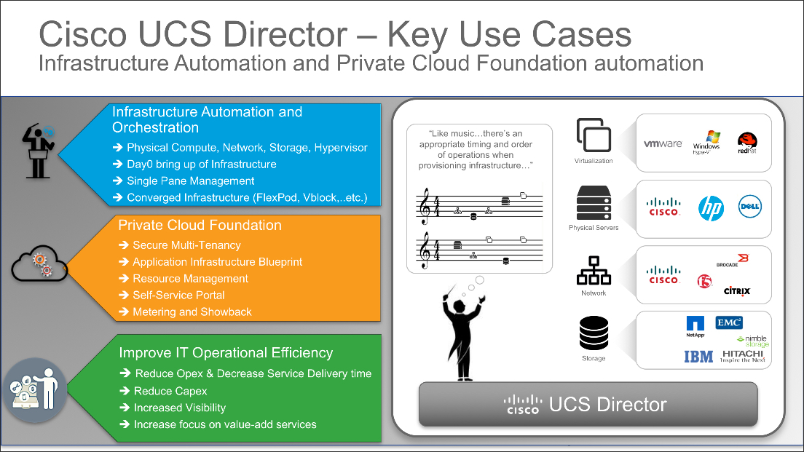  --->

UCS Director is a Turn-Key solution that comes with thousands of built-in tasks, workflows, and an orchestration designer.

UCS Director Turn-Key Solution:

    

  <!---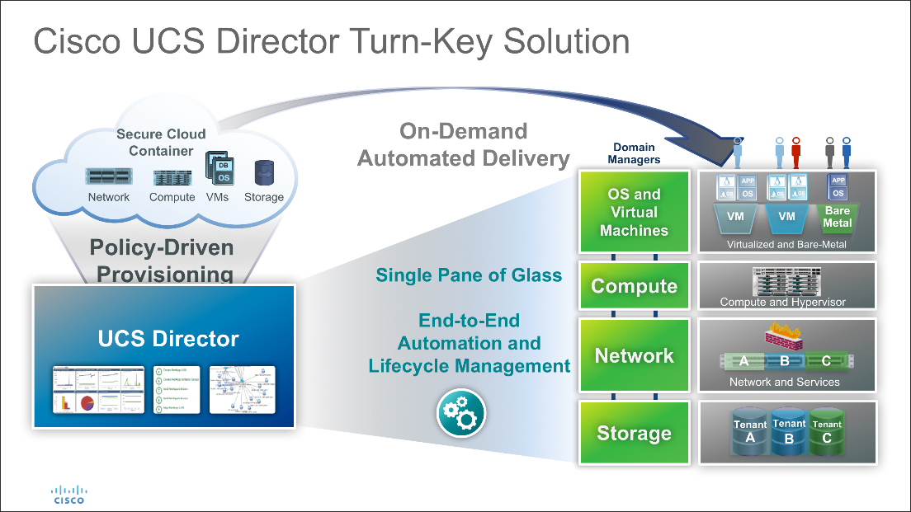  --->

UCS Director Thousands of Built-In Tasks:

    

  <!---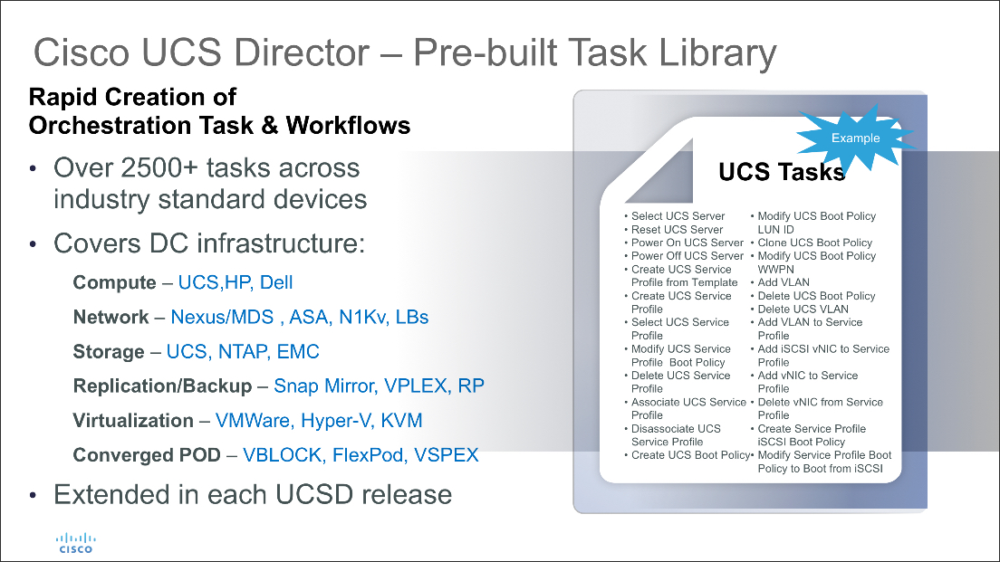  --->

UCS Director Orchestration Designer:

    

  <!---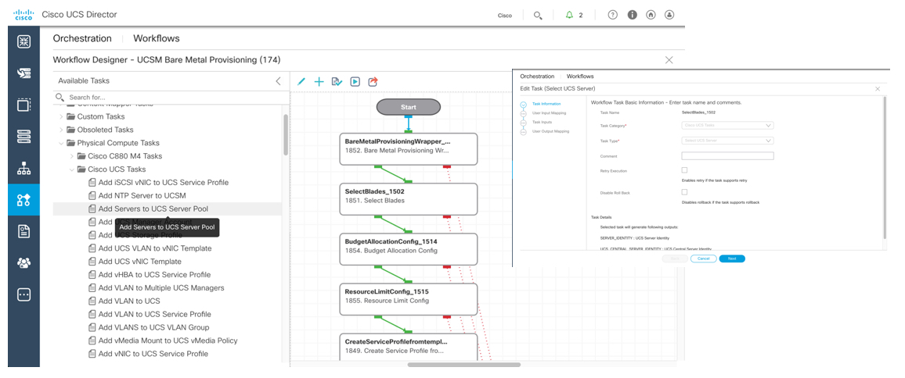  --->

# *** Before You Begin ***

The **admin** user password for UCS Director may have expired. In order to complete this lab and other UCS Director labs in this module the **admin** user password will need to be **reset**. The reset of the admin user password is done by logging into UCS Director CLI interface as the root user and running the password reset script.

The password will be immediately reset to **admin**. If the admin user is denied access using the password **admin** then a restart of the UCS Director Services is required. Please follow the steps below to **reset** the admin user password, **test** the admin user password and **restart** the UCS Director Services **if needed**.

# Password Rest for admin user

  - Open a putty session to the UCS Director CLI interface.

  - ***Click*** the putty icon in the task bar <!--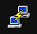-->

  - ***Click*** "UCS Director" under "Saved Sessions"

  - ***Click*** the "Load" button

  - ***Click*** the "Open" button

  - ***Enter*** login name "shelladmin" at the `login as: ` prompt

  - ***Enter*** password "C1sco12345" at the `Password: ` prompt

  - ***Enter*** "23" at the `SELECT> ` prompt

  - ***Enter*** "y" at the `Do you want to Login As Root [y/n]? : ` prompt

  - ***Enter*** password "C1sco12345" at the `Password: ` prompt

  - ***Enter*** the command `/opt/infra/dbPwdReset.sh` at the command prompt `[root@ucsd shelladmin]# ` `/opt/infra/dbPwdReset.sh`

  - ***View*** the message `'admin' password is reset`

  - ***Enter*** `exit` at the command prompt `[root@ucsd shelladmin]# `

  - ***Press*** `return` to return to the `shelladmin` menu.

    
    
    
  <!--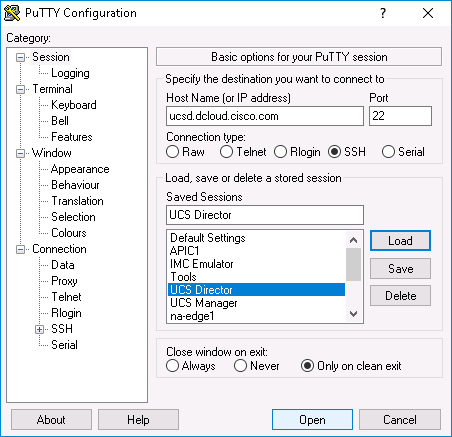  -->
  <!--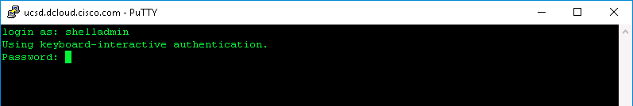  -->
  <!--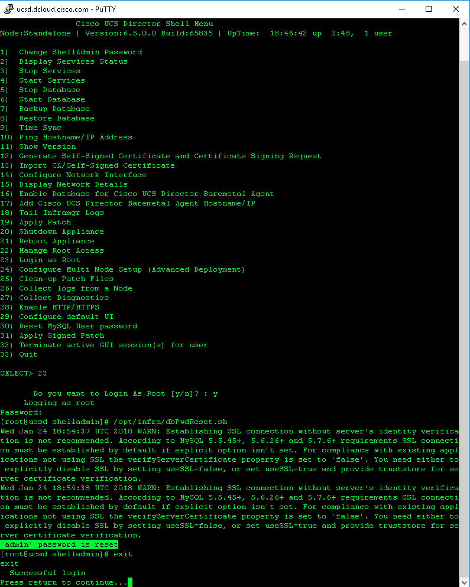  -->

  Test the admin user login with the password **admin** in the UCS Director GUI interface as shown is **Exercise 1** below.

  If the login is successful please exit the `shelladmin` menu and continue with the lab, if the login is not successful then restart the UCS Director Services via the `shelladmin` menu.

# UCS Director Services Reset

  - ***Enter*** "5" at the `SELECT> ` prompt

  - ***Enter*** "y" at the `Do you want to stop database [y/n]? : ` prompt

  - ***Press*** `return` to return to the `shelladmin` menu when indicated.

  - ***Enter*** "6" at the `SELECT> ` prompt to `Start Database`

  - ***Press*** `return` to return to the `shelladmin` menu when indicated.

  - ***Enter*** "4" at the `SELECT> ` prompt to `Start Services`

  - ***Press*** `return` to return to the `shelladmin` menu when indicated.

  To check the state of the UCS Director Services restart use option 2 from the `shelladmin` menu

  - ***Enter*** "2" at the `SELECT> ` prompt

  - ***View*** the `Services State`

  - ***Press*** `return` to return to the `shelladmin` menu when indicated.

    
    
    
    
  <!--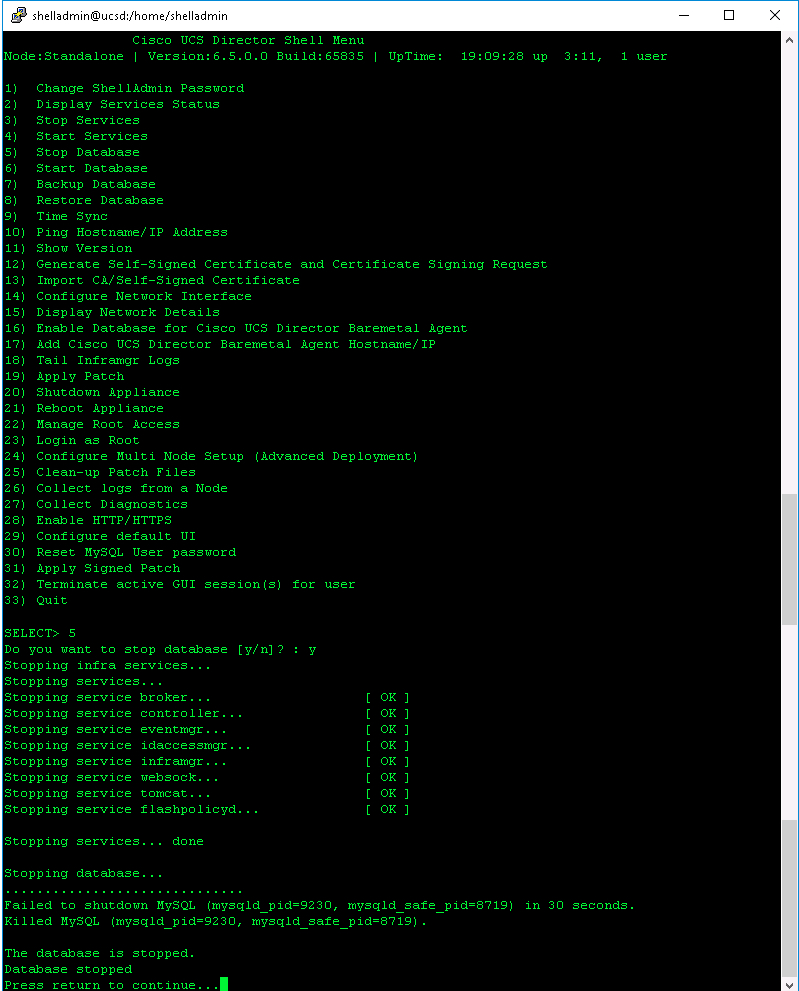  -->
  <!--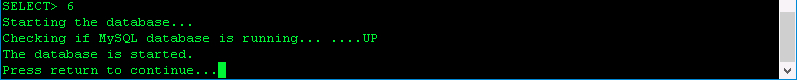  -->
  <!--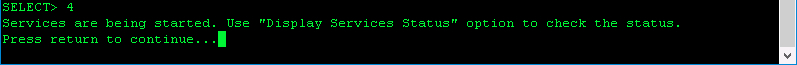  -->
  <!--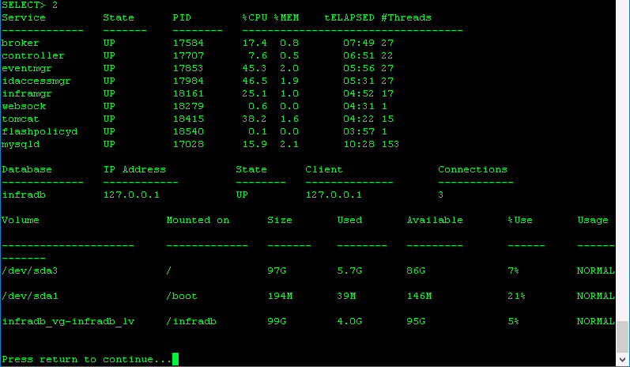  -->

  It can take 20 to 40 minutes for the UCS Director Services to restart and the UCS Director GUI to become active.

# Step 1

This lab focuses on getting you acclimated with UCS Director, adding some new components, and viewing discovered components as well as exploring the interface.

### Exercise 1
Launch and login to UCS Director.

  1. To launch UCS Director double-click the UCS Director icon on the desktop.

  UCS Director Desktop Shortcut:

      

    <!---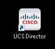  --->

  2. Enter the username and password, and click the **Login** button.
    - `username`: **admin**
    - `password`: **C1sco12345**

  UCS Director Login Screen:

      

    <!---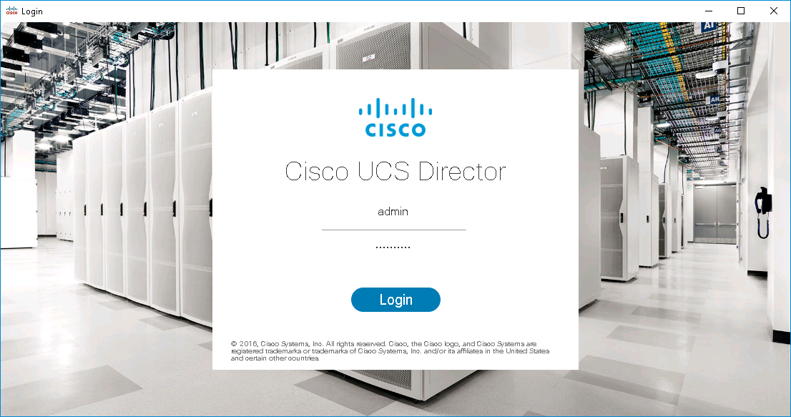  --->

  UCS Director Converged Screen:

      

    <!---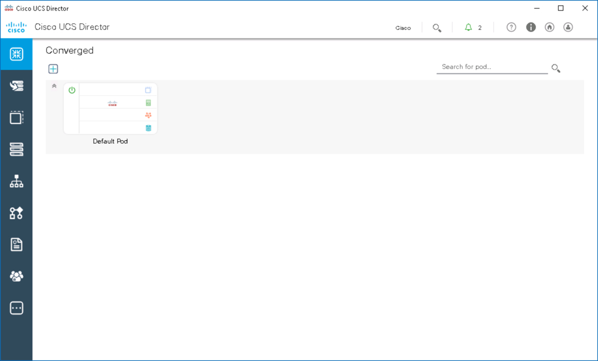  --->

Next step: Add a site and add vCenter to the Default Pod.
