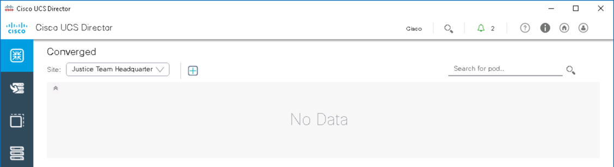
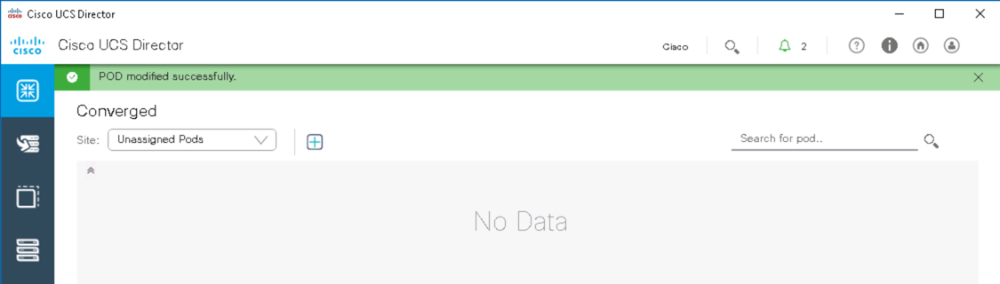
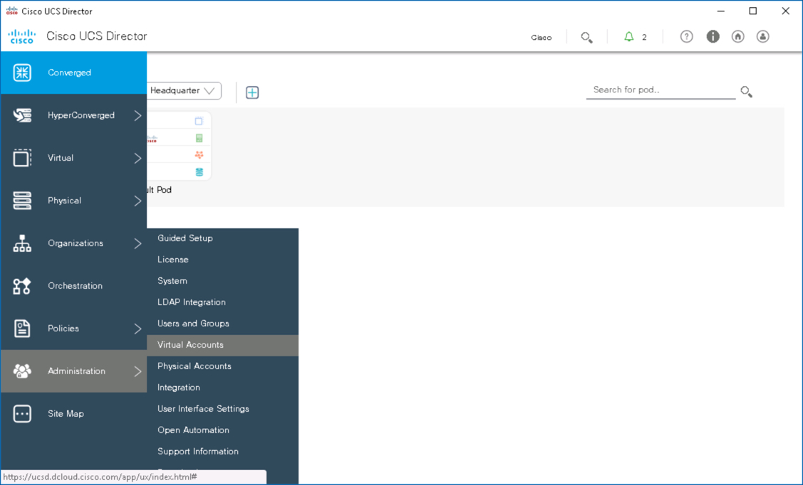
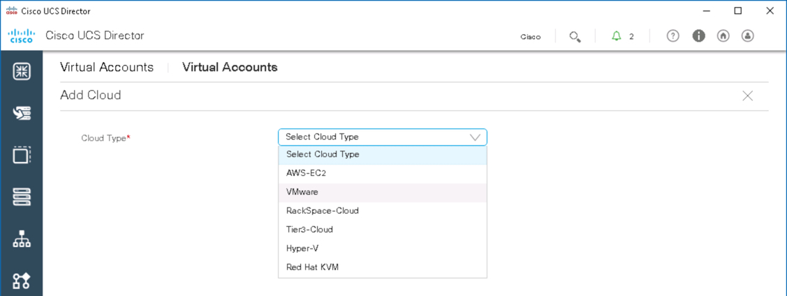
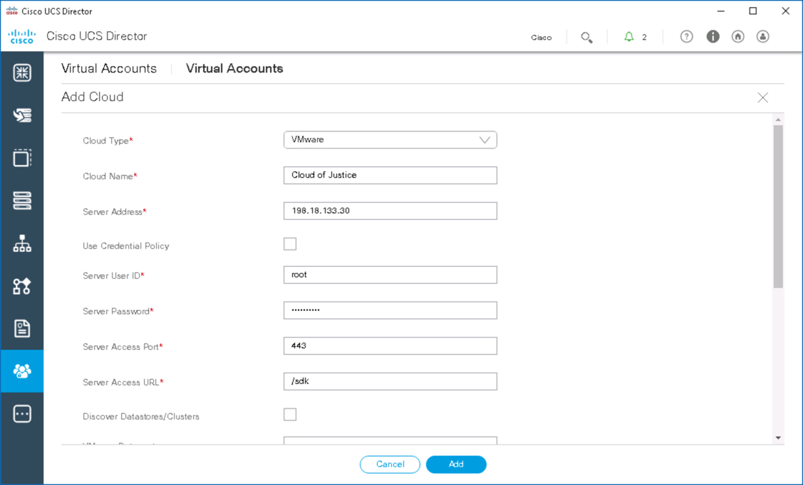
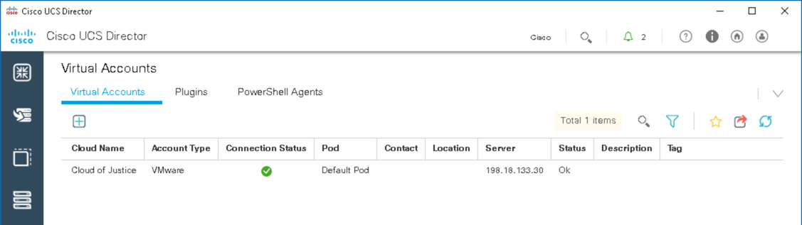

# What is UCS Director - An Introduction to UCS Director

# Step 2
A UCS Director Site is a way to categorize items at a particular location, branch, floor, and so on. On the **Converged** page there is a Pod named `Default Pod` that currently is not assigned to a Site.

A UCS Director Pod is a collection of a Virtualization, Compute, Network, and Storage components. The `Default Pod` needs to be assigned to a Site. Once assigned you'll add a Virtualization component. Notice that a Compute component has already been added.

### Exercise 2
Add a Site and update the `Default Pod` with the Site information.

  1. On the menu bar, choose **Administration** > **Physical Accounts**.
  2. Choose the **Site Management** tab.
  3. Click **Add**.
  4. In the **Add Site** dialog box, complete the following fields:
    - `Site Name`: **Justice Team Headquarters**
    - `Description`: **Justice Team Data Center**
    - `Contact Name`: **Commander Code**

  5. Click **Submit** on the **Add Site** dialog box.
  6. Click **OK** on the **Submit Result** dialog box.

  UCS Director Add Site:

      

    <!---  --->

      

    <!---  --->

      

    <!---  --->

      

    <!---  --->

  7. On the menu bar, click **Converged**.
  8. You'll see that the **Justice Team Headquarters** is the selected site:
    - Click on the drop-down  next to `Site:`
    - Select **Unassigned Pods**.
    - Click on the `Default Pod` to select it.
    - Click **Edit**.
  9. In the **Edit POD** dialog box, complete the following fields:
    - `Type`: Select **Generic**
    - `Site`: Select **Justice Team Headquarters**
    - `Address`: **1 Justice Way**
    - Click **Save** on the **Edit Pod** dialog box.
    - Click **OK** on the **Submit Result** dialog box.
    - Click on the drop-down next to `Site:`
    - Select **Justice Team Headquarters**.

  Now the `Default Pod` is connected to the `Site` **Justice Team Headquarters**.

UCS Director Edit Site:

    

  <!---  --->

    

  <!---  --->

    

  <!---  --->

    

  <!---  --->

    

  <!---  --->

### Exercise 3
Add a vCenter Virtualization component to the `Default Pod`.

  1. On the menu bar, choose **Administration** > **Virtual Accounts**.
  2. Choose the **Virtual Accounts** tab.
  3. Click the **Add** button.
    - For **Cloud Type** select **VMware**
    - Click **Add** on the **Add Cloud** dialog box.
  4. In the **Add Cloud** dialog box, complete the following fields:
    - `Cloud Name`: **Cloud of Justice**
    - `Server Address`: **198.18.133.30**
    - `Server User ID`: **root**
    - `Server Password`: **C1sco12345!**
    - Scroll down to see that the `Default Pod` is already selected for the `Pod` field.
    - Click **Add** on the **Add Cloud** dialog box.
    - Click **OK** on the **Submit Result** dialog box.

  Now vCenter has been added to the `Default Pod`.

  UCS Director Add VMware vCenter Account:

      

    <!---  --->

      

    <!---  --->

      

    <!---  --->

      

    <!---  --->

Next Step: Add an ACI APIC to the `Default Pod`.
