# What is UCS Director - an Introduction to UCS Director

# Step 3
With the Site and Virtualization component added, let's add the ACI APIC component for network management.

### Exercise 4
Add and ACI APIC for Network Management

  1. On the menu bar, choose **Administration** > **Physical Accounts**.
  2. Choose the **Multi-Domain Managers** tab.
  3. Click the "Add" button.
    - ***select*** `Account Type`"**APIC**"
    - ***click*** the "Submit" button on the "Add Account" dialog.
  4. In the "Add Account" dialog box, complete the following fields:
    - `Account Name`: **Justice_Team_APIC**
    - `Pod`: ***select*** **Default Pod***
    - `Server IP`: **198.18.133.200**
    - `Username`: **admin**
    - `Password`: **C1sco12345**
    - ***click*** the "Submit" button on the "Add Account" dialog.
    - ***click*** the "OK" button on the "Submit Result" dialog.

    UCS Director Add APIC Account:

        

      <!---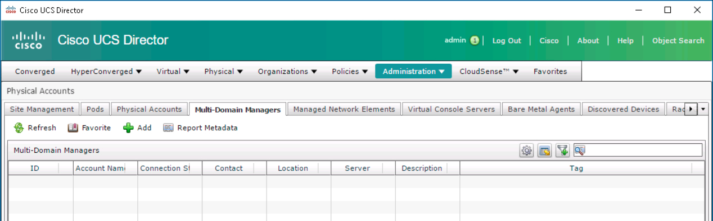  --->

        

      <!---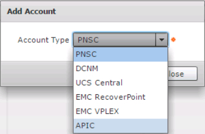  --->

        

      <!---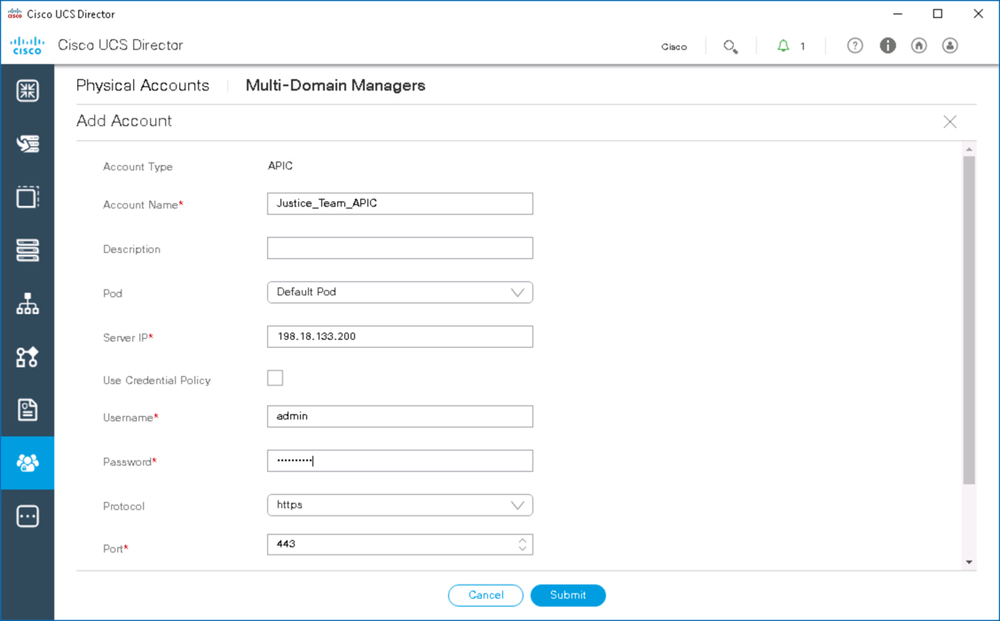  --->

        

      <!---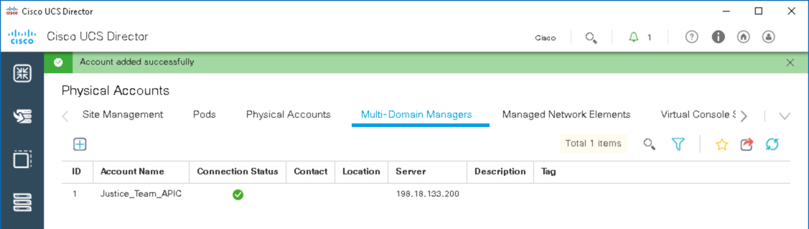  --->

        

      <!---  --->

### Exercise 5
View the components that were just added as well as the Compute component that was already part of the "Default Pod"

  1. On the menu bar, choose **Converged** to view the "Default Pod" with the additional components
    - ***double-click*** the "Default Pod"

  UCS Director Default Pod with Virtualization, Compute and Network Components:

    

  <!---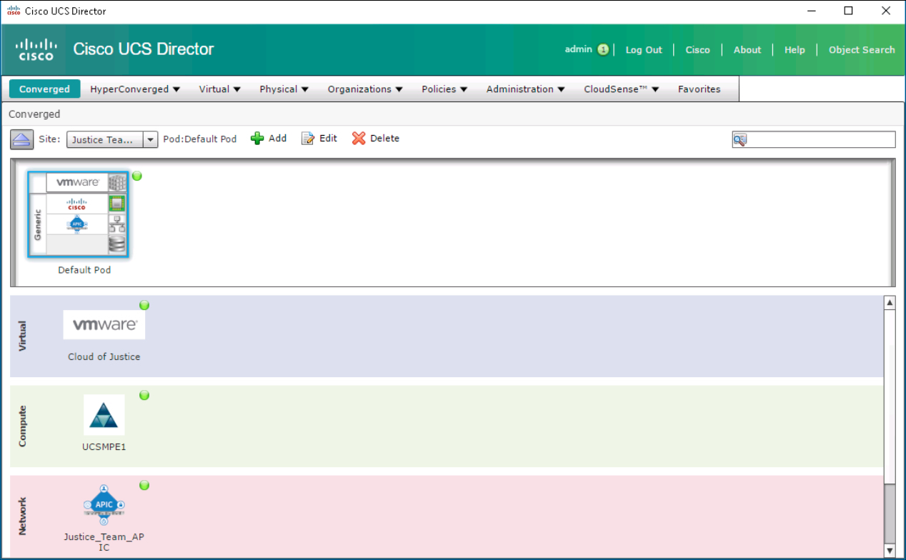  --->

  2. View summary information for each component
    - ***single-click*** the "VMware" icon and view the summary information to the right.

      

    <!---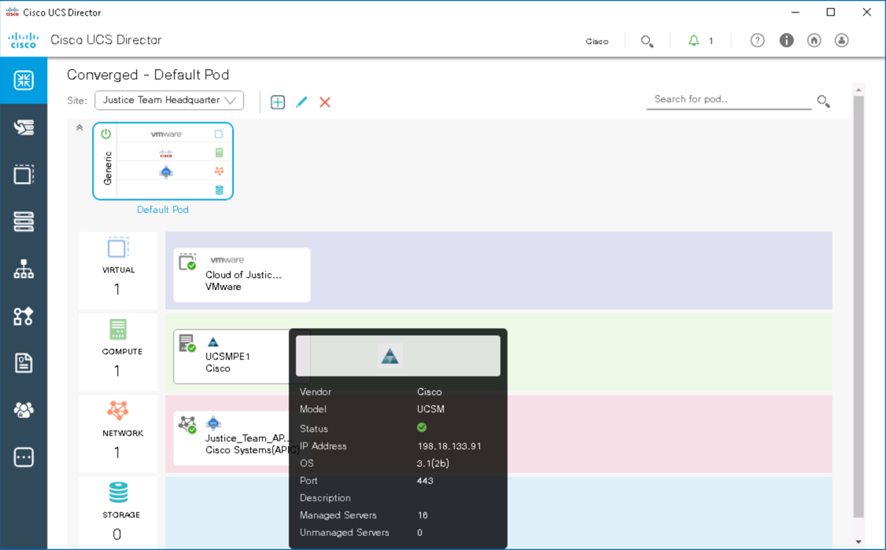  --->

    - ***single-click*** the "UCS" icon and view the summary information to the right.

      

    <!---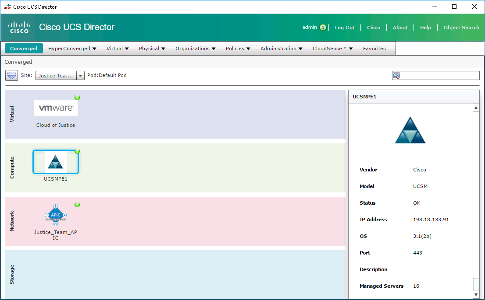  --->

    - ***single-click*** the "APIC" icon and view the summary information to the right.

      

    <!---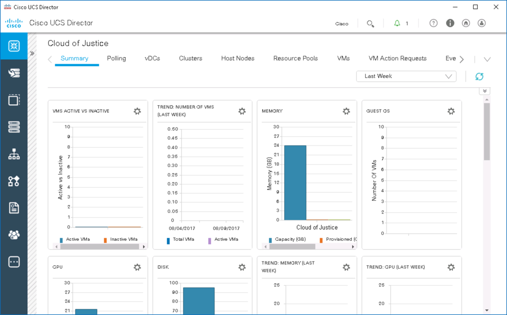  --->

  3. View detailed information for each component
  - ***double-click*** the "VMware" icon and view the detailed information.
    - ***click*** any of the tabs to explore detailed information about the component, use the *right-facing* arrow on the right to reveal more tabs or use the *down-facing* arrow on the right to go directly to a tab.
    - ***click*** the *left-facing* arrow on the left to return to the summary screen and select another component.

      

    <!---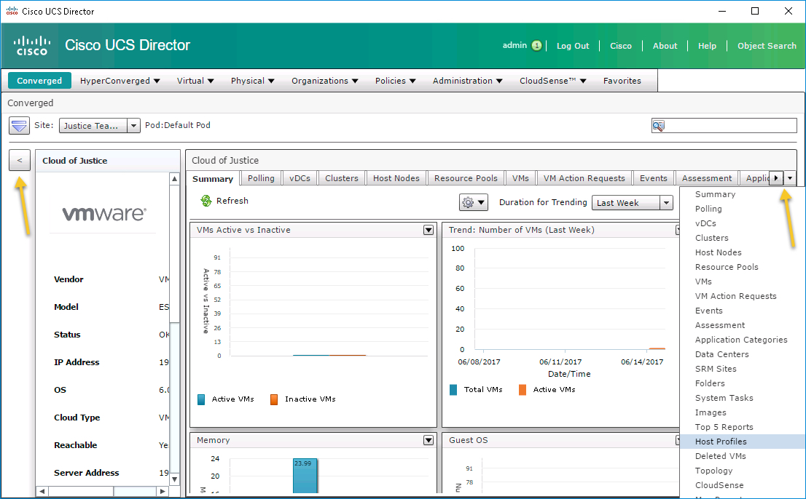  --->

  - ***double-click*** the "UCS" icon and view the detailed information.
    - ***click*** any of the tabs to explore detailed information about the component, use the *right-facing* arrow on the right to reveal more tabs or use the *down-facing* arrow on the right to go directly to a tab.
    - ***click*** the *left-facing* arrow on the left to return to the summary screen and select another component.

      

    <!---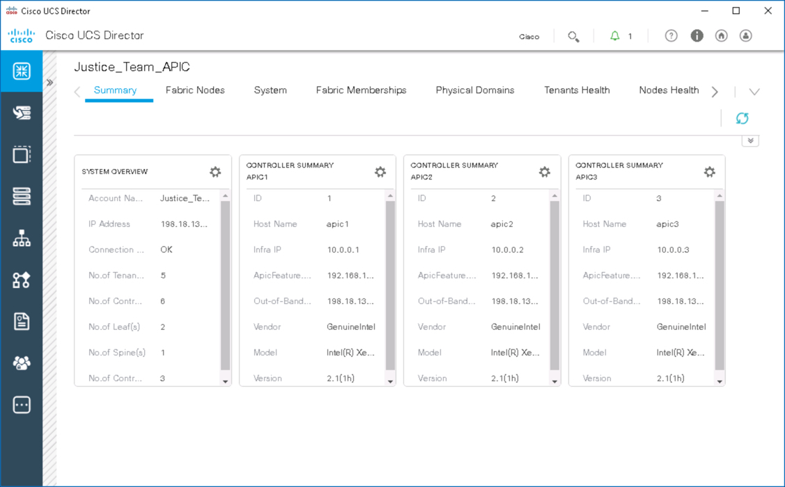  --->

  - ***double-click*** the "APIC" icon and view the detailed information.
    - ***click*** any of the tabs to explore detailed information about the component, use the *right-facing* arrow on the right to reveal more tabs or use the *down-facing* arrow on the right to go directly to a tab.
    - ***click*** the *left-facing* arrow on the left to return to the summary screen and select another component.

      

    <!---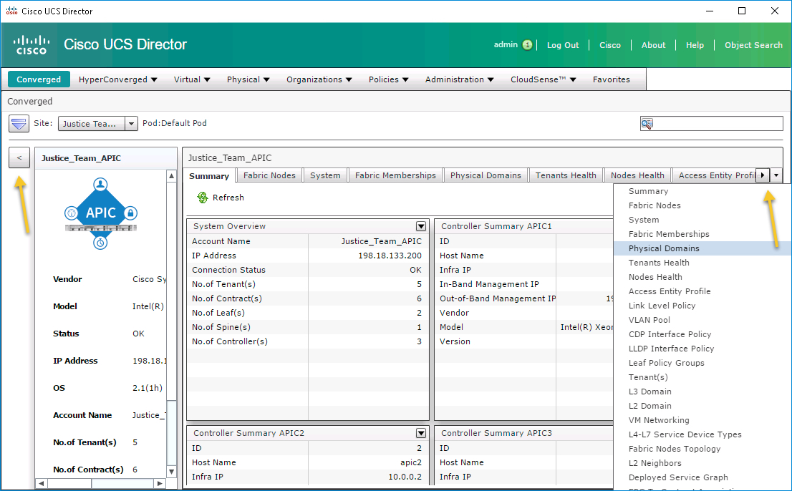  --->

With a populated "Default Pod" the next step would be to use UCS Director to orchestrate and automate your infrastructure with policies and workflows (using built-in and custom tasks). As well UCS Director functionality can be extended using it's "Open Automation SDK", "PowerShell Console", and REST API.

Congratulations! You've Completed the Lab - What is UCS Director - an Introduction to UCS Director.
