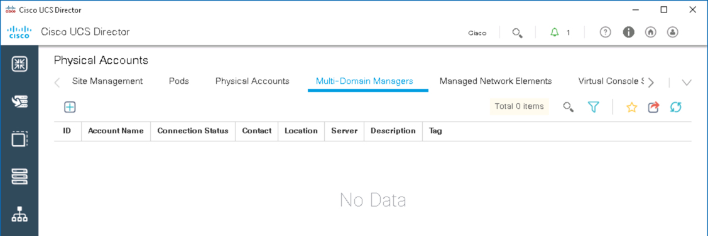
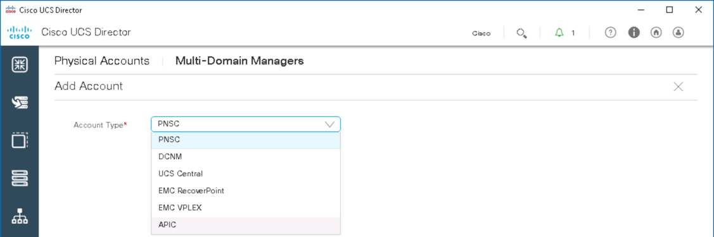
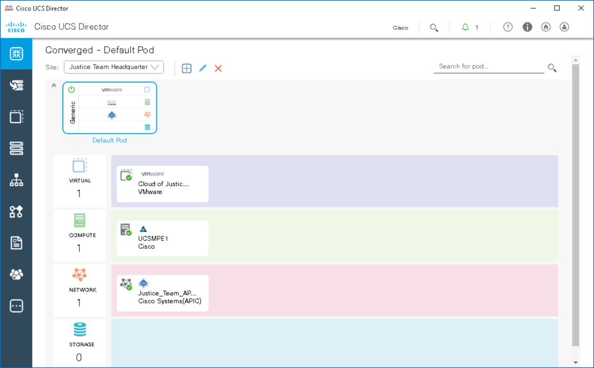
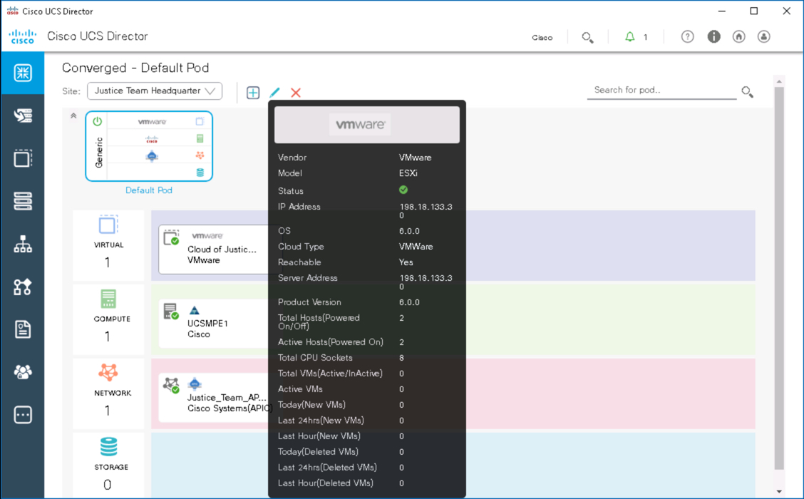
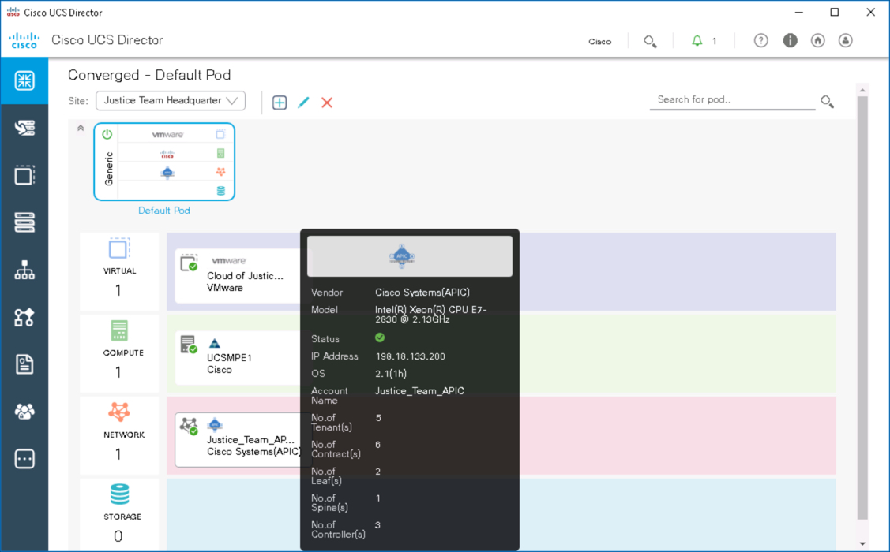
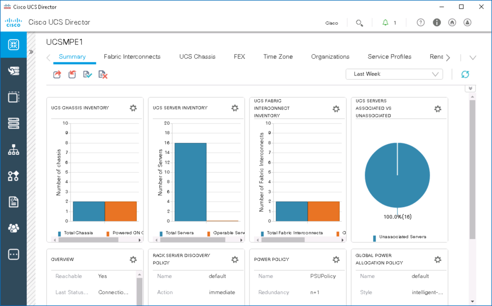

# What is UCS Director - An Introduction to UCS Director

# Step 3
With the Site and Virtualization component added, let's add the ACI APIC component for network management.

### Exercise 4
Add an ACI APIC for Network Management.

  1. On the left side menu bar, choose **Administration** > **Physical Accounts**.
  2. Choose the **Multi-Domain Managers** tab.
  3. Click the **Add** icon.
    - For `Account Type`select **APIC**
    - Click **Submit** on the **Add Account** screen.
  4. In the **Add Account** screen, complete the following fields:
    - `Account Name`: **Justice_Team_APIC**
    - `Pod`: Select **Default Pod**
    - `Server IP`: **198.18.133.200**
    - `Username`: **admin**
    - `Password`: **C1sco12345**
    - Click **Submit** on the **Add Account** screen.

    UCS Director Add APIC Account:

        

      <!---  --->

        

      <!---  --->

        

      <!---  --->

        

      <!---  --->

### Exercise 5
View the components that were just added as well as the Compute component that was already part of the `Default Pod`.

  1. On the left side menu bar, choose **Converged** to view the `Default Pod` with the additional components:
    - Click the `Default Pod`

  UCS Director Default Pod with Virtualization, Compute and Network Components:

    

  <!---  --->

  2. View summary information for each component:
    - Hover over the **VMware** icon to view summary information.

      

    <!---  --->

    - Hover over the **UCS** icon to view summary information.

      

    <!---  --->

    - Hover over the **APIC** icon to view summary information.

      

    <!---  --->

  3. View detailed information for each component:  

   - Click the **VMware** icon and view the detailed information:
     - Click any of the tabs to explore detailed information about the component; use the right-facing arrow on the right to reveal more tabs or use the down-facing arrow on the right to go directly to a tab.
     - Click the right-facing arrow on the left to return to the summary screen and select another component.

      

    <!---  --->

   - Click the **UCS** icon and view the detailed information:
     - Click any of the tabs to explore detailed information about the component; use the right-facing arrow on the right to reveal more tabs or use the down-facing arrow on the right to go directly to a tab.
     - Click the right-facing arrow on the left to return to the summary screen and select another component.

      

    <!---  --->

   - Click the **APIC** icon and view the detailed information:
     - Click any of the tabs to explore detailed information about the component; use the right-facing arrow on the right to reveal more tabs or use the down-facing arrow on the right to go directly to a tab.
     - Click the right-facing arrow on the left to return to the summary screen and select another component.

      

    <!---  --->

With a populated `Default Pod` the next step would be to use UCS Director to orchestrate and automate your infrastructure with policies and workflows (using built-in and custom tasks). As well, UCS Director functionality can be extended using its Open Automation SDK, PowerShell Console, and REST API.

Congratulations! You've completed the lab - ***What is UCS Director - An Introduction to UCS Director***.
