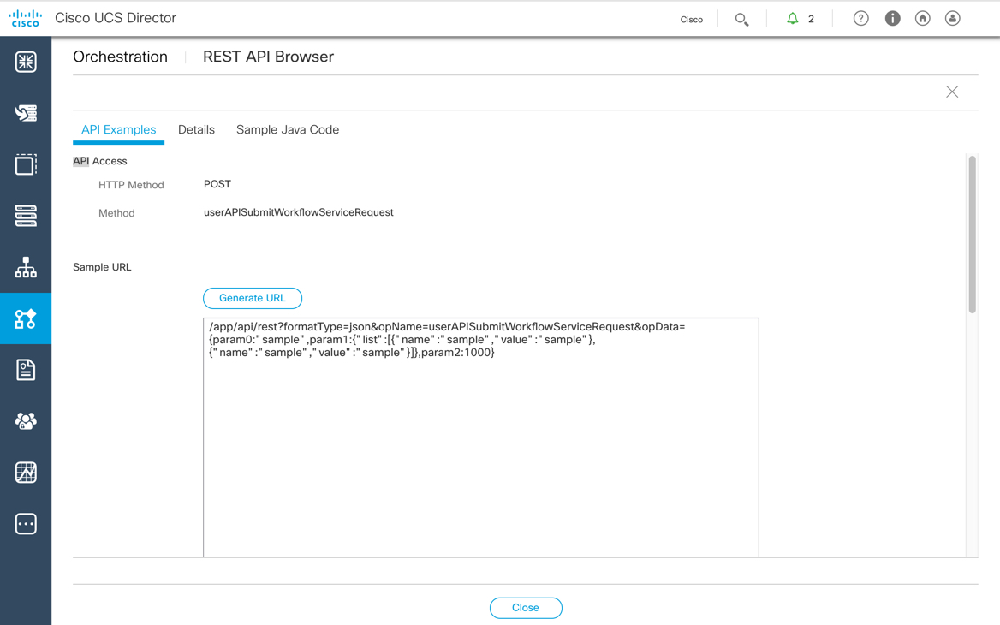

# Mission: Using the UCS Director REST API to Execute Workflows and View their Status

### Exercise 1 - Solution

- On the menu bar, choose **Policies** > **Orchestration**.
- ***click*** the "Workflows" tab, if it is not already selected.
- ***click*** the "Import" button
- Import dialog
  - Page 1 - "File Upload/Validation"
    - ***click*** the Upload... button
    - Use the "File Upload" dialog to upload the file
    ```code
    C:\Users\demouser\CiscoDevNet\code\LM-5701 ucsd api\dne-dcip-ucsd-infrastructure-automation-api-mission.wfdx
    ```
    - ***click*** the "Submit" button
    - ***click*** the "Next" button
  - Page 2 - "Import Policies"
    - ***click*** the "Import" button
  - ***click*** the "OK" button

  <br/><br/>

  <!---<br/><br/>--->

  <br/><br/>

  <!---<br/><br/>--->

  <br/><br/>

  <!---<br/><br/>--->

  <br/><br/>

  <!---<br/><br/>--->

- ***click*** the "twistie" next to the "Justice Team" folder, the "Mac_Converter_v1_0" workflow will be listed
- ***click*** the *down-facing* arrow on the right of the screen and ***select*** "Custom Workflow Tasks"
- ***click*** the "Refresh" button and find that a custom task called "Mac_Converter_v1" has been added. You may have to scroll to the bottom of the list.

  <br/><br/>

  <!---<br/><br/>--->

  <br/><br/>

  <!---<br/><br/>--->

### Exercise 2

Use a REST API call to Execute the Workflow

The workflow "Mac_Converter_v1_0" has a single parameter that takes a single value.

  - `mac`: **00:25:B5:00:00:00**
    - The workflow accepts an input called **mac**, it is important to note that a workflow can request multiple inputs that can be used throughout the workflow process. The names of the inputs to the workflow *do not* have to match the name of the inputs to the tasks that the workflow utilizes.
  - Workflow and Task input names are case-sensitive

1. Find the REST API call in the REST API Browser
  - ***click*** the *down-facing* arrow on the right of the screen and ***select*** "REST API Browser"
  - Search for the call `UserAPIGlobal@userAPISubmitWorkflowServiceRequest`
  - Generate the REST API URL
  - Update the URL with the correct parameters
    - `param0`: Name of Workflow
      - **Mac_Converter_v1_0**
    - `param1`: Input parameters
      - **"name":"mac","value":"00:25:B5:00:00:00"**
    - `param2`: Parent Service Request ID
      - **-1** (-1 indicates that there is not a parent SR)
  - Execute the URL via Postman, get the REST API Key first
    - Add the **X-Cloupia-Request-Key** Header
    - API Call **getRESTKey**
      - `user`: **admin**
      - `password`: **C1sco12345**
      - `/app/api/rest?opName=getRESTKey&user=admin&password=C1sco12345`

Go to the next page for the solution...
