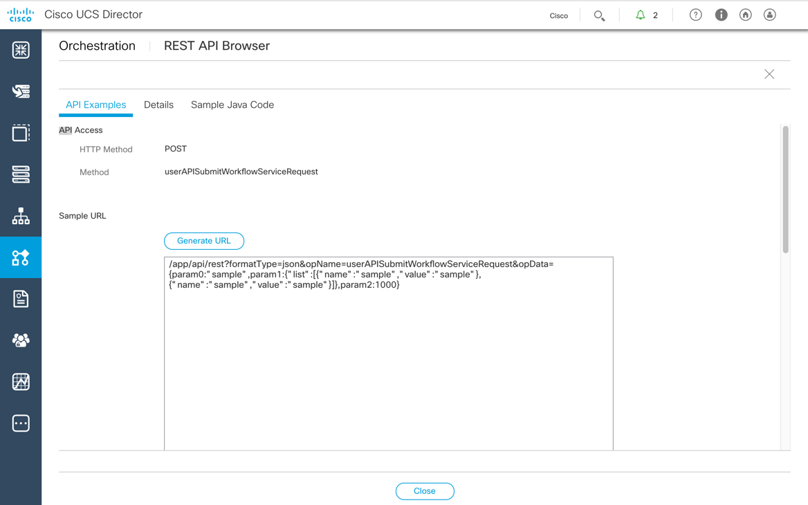
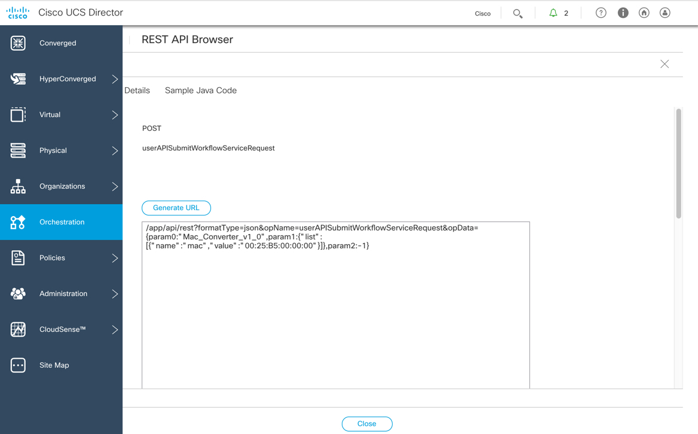
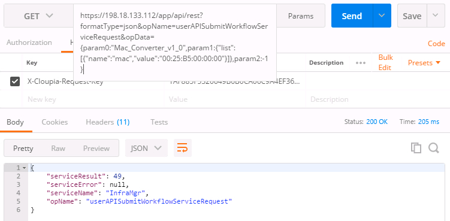

# Mission: Using the UCS Director REST API to Execute Workflows and View their Status

### Exercise 2 - Solution

- On the menu bar, choose **Orchestration**.
- Find the REST API call in the REST API Browser
  - Click the down-facing arrow on the right of the screen and select **REST API Browser**
  - Filter for  `UserAPIGlobal@userAPISubmitWorkflowServiceRequest`
  - Click **Generate URL**

    <br/><br/>

    <!---<br/><br/>--->

  - Update the URL with the correct parameters
    - `param0`: **Mac_Converter_v1_0**
    - `param1`: **"name":"mac","value":"00:25:B5:00:00:00"**
    - `param2`: **-1**

    <br/><br/>

    <!---<br/><br/>--->

  - Execute the URL via Postman
    - Get the REST API Access key and add as a `Header` in Postman.

    ```code
    https://198.18.133.112/app/api/rest?opName=getRESTKey&user=admin&password=C1sco12345
    ```

    <br/><br/>

    <!---<br/><br/>--->

    <br/><br/>

    <!---<br/><br/>--->

    ```code
    https://198.18.133.112/app/api/rest?formatType=json&opName=userAPISubmitWorkflowServiceRequest&opData={param0:"Mac_Converter_v1_0",param1:{"list":[{"name":"mac","value":"00:25:B5:00:00:00"}]},param2:-1}  
    ```

    <br/><br/>

    <!---<br/><br/>--->

### Exercise 3

Use the REST API to view the status of the executed workflow.
1. Find the REST API call in the REST API Browser
  - Click the down-facing arrow on the right of the screen and select **REST API Browser**
  - Search for the call `UserAPIGlobal@userAPIGetServiceRequestLogEntries`
  - Generate the REST API URL
  - Update the URL with the correct parameters
    - `param0`: Service Request ID Number
    - `param1`: Log severity level - change to `0`
  - Execute the URL via Postman, get the REST API Key, if you have not already done so.
    - Add the **X-Cloupia-Request-Key** Header
    - API Call **getRESTKey**
      - `user`: **admin**
      - `password`: **C1sco12345**
      - `/app/api/rest?opName=getRESTKey&user=admin&password=C1sco12345`

2. Locate the following two log entries
  - **"InputString is: 00:25:B5:00:00:00"**
  - **"OutputString is: 00-25-B5-00-00-00"**

Go to the next page for the solution...
