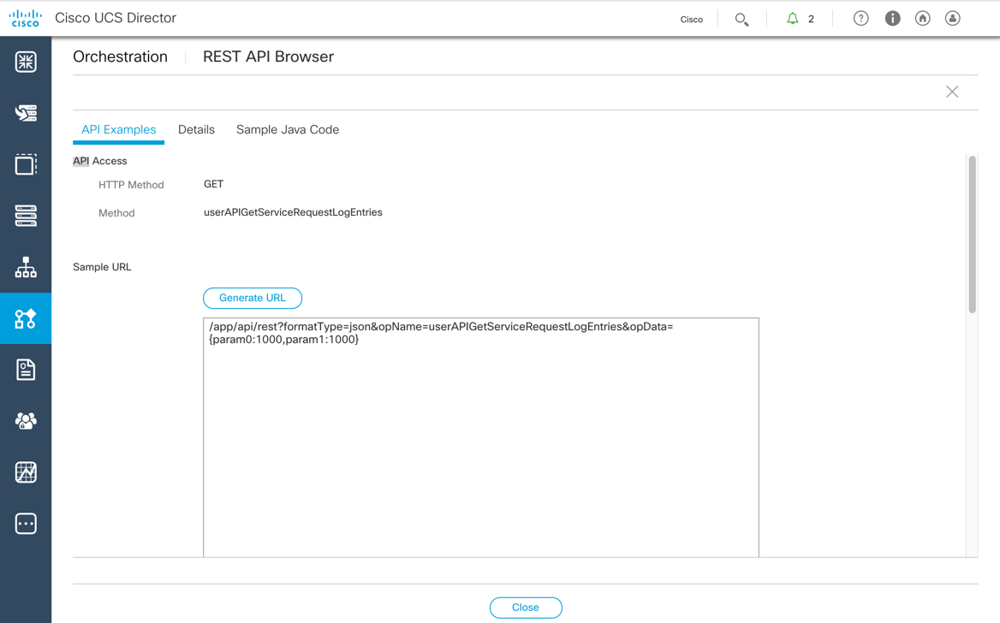

# Mission: Using the UCS Director REST API to Execute Workflows and View their Status

### Exercise 3 - Solution

- Find the REST API call in the REST API Browser
  - Click the down-facing arrow on the right of the screen and select **REST API Browser**
  - Filter for  `UserAPIGlobal@userAPIGetServiceRequestLogEntries`
  - Click **Generate URL**

    <br/><br/>

    <!---<br/><br/>--->

  - Update the URL with the correct parameters
    - `param0`: Service Request IP, for example 11
    - `param1`: Log Severity Level "0"

    <br/><br/>

    <!---<br/><br/>--->

  - Execute the URL via Postman
    - Get the REST API Access key and add as a `Header` in Postman.

    <br/><br/>

    <!---<br/><br/>--->

    <br/><br/>

    <!---<br/><br/>--->

    ```code
    https://198.18.133.112/app/api/rest?formatType=json&opName=userAPIGetServiceRequestLogEntries&opData={param0:11,param1:1000}
    ```

    <br/><br/>

    <!---<br/><br/>--->

Congratulations you have completed the Mission - Using the UCS Director REST API to Execute Workflows and View their Status
