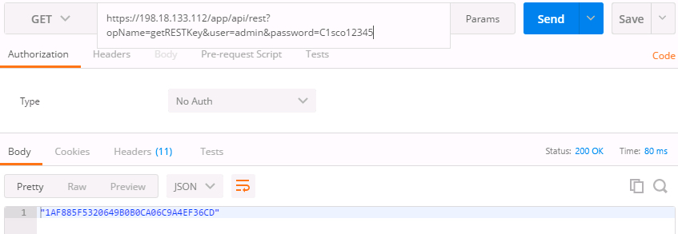
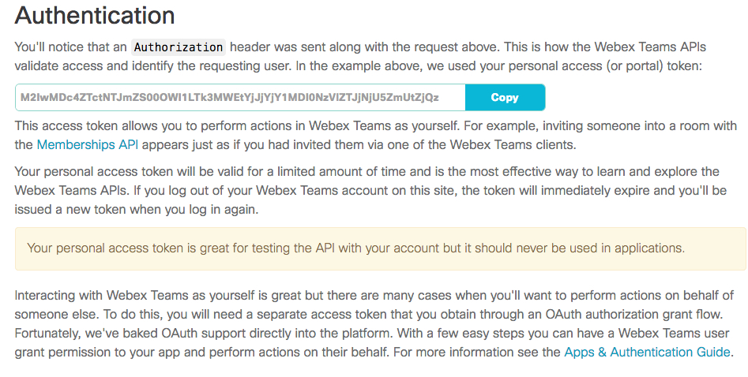
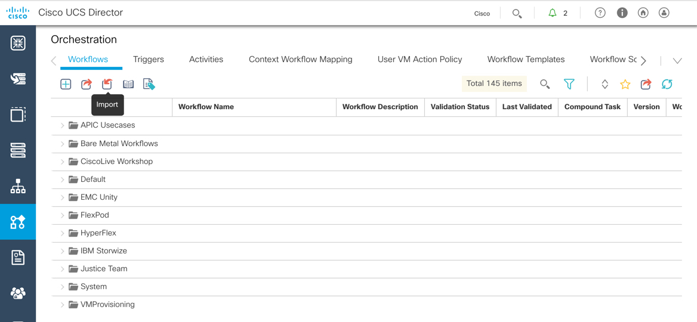
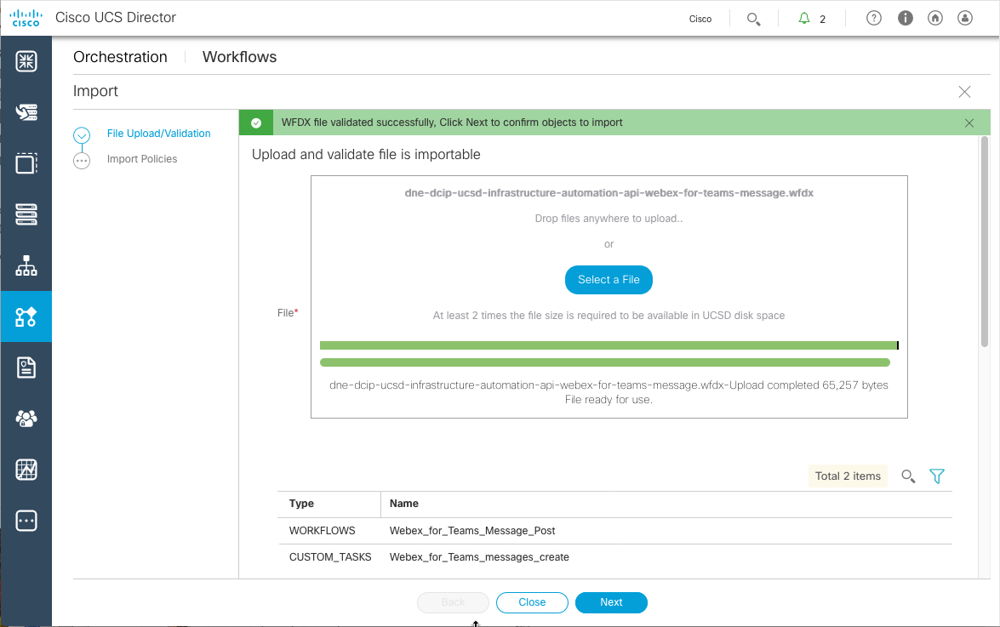
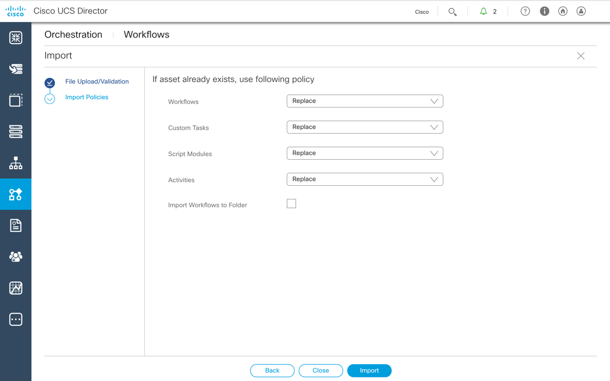
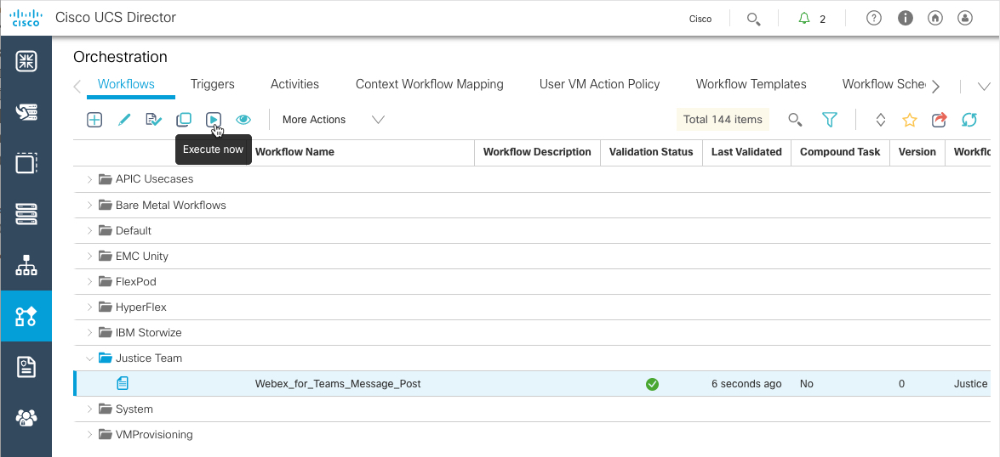
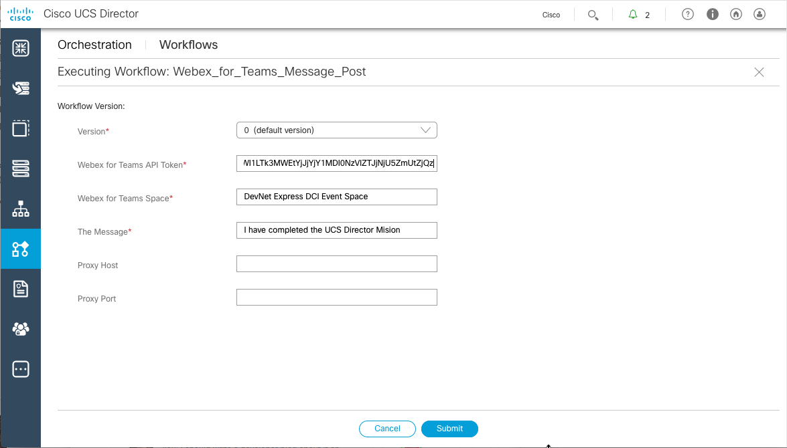
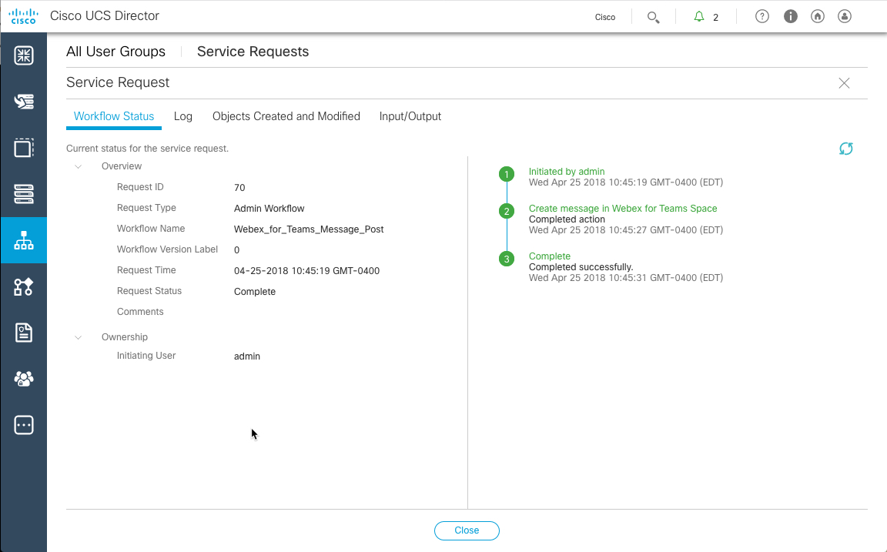

# Mission: Using the UCS Director REST API to Execute Workflows and View their Status

### Exercise 3 - Solution

- Find the REST API call in the REST API Browser
  - Click the down-facing arrow on the right of the screen and select **REST API Browser**
  - Filter for  `UserAPIGlobal@userAPIGetServiceRequestLogEntries`
  - Click **Generate URL**

    <br/><br/>

    <!---<br/><br/>--->

  - Update the URL with the correct parameters
    - `param0`: Service Request IP, for example 11
    - `param1`: Log Severity Level "0"

    <br/><br/>

    <!---<br/><br/>--->

  - Execute the URL via Postman
    - Get the REST API Access key and add as a `Header` in Postman.

    <br/><br/>

    <!---<br/><br/>--->

    <br/><br/>

    <!---<br/><br/>--->

    ```code
    https://198.18.133.112/app/api/rest?formatType=json&opName=userAPIGetServiceRequestLogEntries&opData={param0:11,param1:1000}
    ```

    <br/><br/>

    <!---<br/><br/>--->

### Mission Completion

Update the **Event Spark Room** with a ***Completion Message***

  1. Retrieve your Spark API Access Token. This token is your permanent developer token and is used to access Spark APIs.

    - Login to [Spark Developer Website](https://developer.ciscospark.com/)
    - ***Click*** on your profile image
    - ***Click*** **Copy** to copy your access token to the clipboard<br/><br/>

    <br/><br/>

    <!---<br/><br/>--->

  2. Import the **Spark_Message_Post** Workflows

    - On the left side menu bar, choose **Orchestration**.
    - Click the **Workflows** tab, if it is not already selected.
    - Click the **Import** icon
    - On the **Import** screen:
      - On page 1 **File Upload/Validation**:
        - Click **Select a File**
        - Use the **File Upload** dialog box to upload the file
        ```code
        C:\Users\demouser\CiscoDevNet\code\LM-5701 ucsd api\dne-dcip-ucsd-infrastructure-automation-api-spark-message.wfdx
        ```
        - Click **Next** when the file upload has been completed and the contents of the upload are displayed.
      - On Page 2 **Import Policies**
      - Click **Import**

      <br/><br/>

      <!---<br/><br/>--->

      <br/><br/>

      <!---<br/><br/>--->

      <br/><br/>

      <!---<br/><br/>--->

    - Click the twistie next to the **Justice Team** folder, and the **Spark_Message_Post** workflow is listed.

      <br/><br/>

      <!---<br/><br/>--->

  3. Execute the workflow

    - Click on the workflow to select it
    - Click the **Execute Now** icon to execute the workflow
    - Enter your **Spark API Token**
    - Enter the name of the **DevNet Event Spark Room** for the event you are attending
    - Enter the Message **I have completed the UCS Director Mission**</br></br>

    <br/><br/>

    <!---<br/><br/>--->

    <br/><br/>

    <!---<br/><br/>--->

    If the Infrastructure that is being utilized requires a proxy enter those values, the trainers will notify you if a proxy is required.  Typically **no proxy information is required**.

    - Click "Submit"
    - Click "Show Detail Status"
    - Browse these tabs to view the status of the workflow
      - "Workflow Status"
      - "Log"

      <br/><br/>

      <!---<br/><br/>--->

  4. View your message in the DevNet Express Event Room.

    <br/><br/>

    <!---<br/><br/>--->

Congratulations you have completed the Mission - Using the UCS Director REST API to Execute Workflows and View their Status
